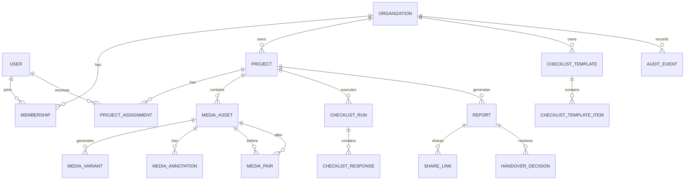
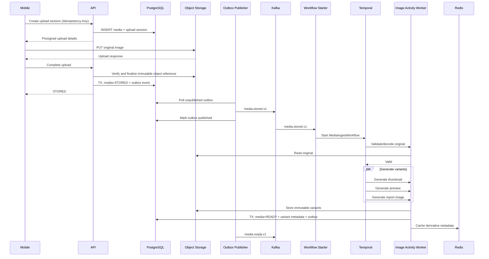
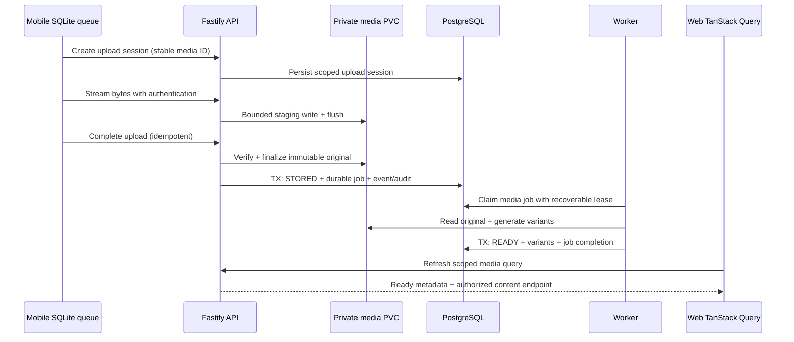
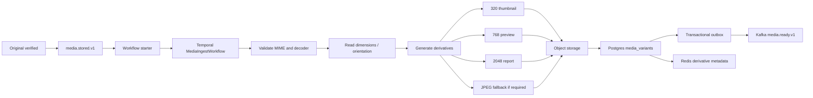

# Engineering Blueprint and Master Prompt for a CompanyCam-Style Proof-of-Work Platform

## Review status and how to use this document

**Revised September 15, 2026.** This revision prepares the engineering brief before implementation. The repository currently contains this report and no application code or package manifests.

- **Explicit client requirement:** use TanStack Query (`@tanstack/react-query`) on both Next.js web and Expo mobile.
- **Deployment and budget requirement:** use the owner's existing k3s platform, following `rruge.com` deployment conventions. The first trial must require no new paid storage, hosted service, subscription or free trial that converts to billing.
- **Confirmed project identity:** the owner has `handovertrack.com` ready on Cloudflare and the existing iOS bundle identifier `com.gementis.handovertrack`. Use these exact values.
- **Start with the first implementation prompt.** The step-by-step agent plan and Task 01 prompt below define the next assignment. The general master prompt remains architecture/reference context; it is not the first agent kickoff.
- **Treat estimates and unspecified product decisions as assumptions.** Live cluster capacity, DNS-to-origin routing/TLS, independent backup space, device support and retention still need verification. Existing hardware, electricity, bandwidth and operator time remain real costs; this plan targets no additional service spending.
- **Source status:** new and corrected guidance includes direct official-source links. Opaque citation markers in the original research are historical references without a source map in this file; they are not verified citations. Recheck affected dependency and infrastructure claims before relying on them.

## Executive summary

Start with a **modular monolith, one worker, PostgreSQL and private files on the existing k3s disk**. This is the recommended first trial following the owner's no-new-service-spend direction and Rrugë's existing pattern. Keep Kafka, Temporal and S3-compatible storage as an explicit self-hosted expansion; they are deferred from the first trial, not removed from the longer-term architecture.

The central architecture should be:

> **Postgres owns business truth and durable trial job state. Private retained files own server media. Mobile SQLite and app-owned files preserve offline work. TanStack Query provides reactive data access on both clients. In the expanded profile, Kafka distributes domain events, Temporal orchestrates durable processes, S3-compatible storage holds media, and Redis remains optional caching.**

The main engineering risk is **not Kafka throughput, report generation, or your React dashboard**. It is the field reliability path:

**camera → durable local file → SQLite queue → reconnect → authenticated upload → verified immutable server file → durable processing job → derivative → project visibility**

That path must survive airplane mode, flaky cellular connections, app restarts, duplicate requests, process crashes, token expiration, worker restarts, and user retries.

Expo explicitly warns that background work is deferrable, operating-system controlled, and can stop when the user kills the application. Therefore background execution can improve uploads, but **correctness cannot depend on it**. Expo SQLite persists across app restarts and supports WAL and transactions, making it appropriate for the local durable queue and offline database. citeturn14search1turn16view0

I recommend the following baseline stack:

| Area | Recommendation | Reason |
|---|---|---|
| Language | **TypeScript** | Default assumption; lets the small team share tooling and generated contracts. |
| Backend runtime | **Node.js 24 LTS candidate; pin after compatibility validation** | Validate auth/native modules/pnpm/image for trial; Kafka/Temporal checks apply when enabled. |
| API | **Fastify + TypeScript + OpenAPI** | Lightweight HTTP boundary; domain remains framework-independent. |
| DB access | **Kysely + PostgreSQL + SQL migrations** | Strong SQL visibility without pushing persistence concepts into domain objects. |
| Web/admin | **Next.js App Router + React + TypeScript** | Full-stack admin/customer portal with server and client rendering options. |
| Mobile | **React Native + Expo + Expo Router** | Appropriate for a small cross-platform team. |
| Client data access | **TanStack Query on web and mobile** | Shared query conventions with platform-specific fetching and durable mobile SQLite underneath. |
| Mobile DB | **expo-sqlite** | Persistent offline relational state. Expo documents WAL and transaction APIs. citeturn16view0 |
| Authentication | **Self-hosted Better Auth, following Rrugë** | Use the maintained library and its Expo integration; no paid identity provider required. |
| Trial background work | **PostgreSQL outbox/jobs + one worker** | Transactional enqueue, durable retries and explicit job state without a broker. |
| Expanded orchestration | **Self-hosted Kafka + Temporal** | Add after the trial, with capacity and replay/recovery checks. |
| Cache | **No Redis service initially** | Read Postgres; add a disposable self-hosted cache only after measuring need. |
| Primary DB | **PostgreSQL** | Transactions, relational constraints, tenant security options. |
| Media | **Private retained filesystem PVC initially** | Bounded authenticated upload/download; S3-compatible adapter is an expansion. |
| Image processing | **Sharp/libvips workers** | Pre-generate standard variants rather than transforming every request. |
| Observability | **Structured logs, health/queue/disk checks, OTel-ready instrumentation** | Reuse available tooling; do not require a paid APM or another large stack. |
| Deployment configuration | **Kubernetes manifests + Kustomize overlays** | Reuse existing k3s; Terraform is optional for future external resources. |
| CI/CD | **Existing CI/registry allowance + server-side pull deployment** | Follow Rrugë's immutable artifact flow; CI does not receive cluster credentials. |
| Compute | **Owner's existing k3s cluster** | Reuse its shared Caddy edge, TLS and retained local storage conventions. |
| Initial operating model | **Self-hosted trial within verified spare capacity** | No mandatory managed database, storage, identity, messaging or observability bills. |

**Runtime compatibility must be verified against released versions.** At this review, Node 24 is Active LTS and is the trial candidate. Validate clean installation, auth integration, native-module loading and API/media-worker startup for the intended container/CPU architecture. For the expanded profile, Confluent Kafka JavaScript v1.10.1 lists Node 24 support while pnpm remains experimental; its overview still lists only through Node 22. Add produce/consume and Temporal compatibility checks when those adapters are introduced. Pin tested versions and record fallback/upgrade deadlines in an ADR. [Node release schedule](https://github.com/nodejs/Release#release-schedule), [versioned Confluent requirements](https://github.com/confluentinc/confluent-kafka-javascript/blob/v1.10.1/README.md#requirements), [Confluent overview](https://docs.confluent.io/kafka-clients/javascript/current/overview.html).

**Delivery planning:** use acceptance-driven milestones below. The earlier 8–14 week estimate assumed a five-person team and managed infrastructure; it is not a commitment for this self-hosted trial. Re-estimate after the first capture/upload slice, real device testing and cluster-capacity checks.

The first product should implement only:

**organizations/users → projects → field assignments → offline photo capture → reliable upload → image variants → required-photo checklist → notes/annotations → before/after pairing → completion report → secure client share → accept/request correction → audit trail.**

Do **not** put video, AI reports, CRM, invoicing, payments, social-media features, LiDAR, generalized automation, or dozens of integrations into the MVP.

## Assumptions and key architecture decisions

The following assumptions should be stated explicitly in the engineering prompt so engineers do not quietly invent different ones.

| Assumption | Working decision |
|---|---|
| Product stage | Greenfield or early-stage codebase; inspect existing implementation before replacing anything. |
| Target customer | Small contractor/field-service crews documenting completed work. |
| Mobile priority | iOS and Android field application; offline operation is critical. |
| Domain | **`handovertrack.com`, ready on Cloudflare according to the owner.** Canonical application origin: `https://handovertrack.com`. |
| iOS app identity | **Existing bundle identifier: `com.gementis.handovertrack`.** Preserve it in Expo and native signing configuration. |
| Web priority | Manager/admin console plus lightweight customer sharing experience. |
| Client query layer | **TanStack Query is required on web and mobile. SQLite remains mobile's durable offline store.** |
| Backend language | **Node.js/TypeScript unless an existing repository already establishes Go.** |
| Media | Still photography first. Video deferred. |
| Tenant model | Multi-tenant SaaS, one organization/company containing users and projects. |
| Geography | Existing k3s node location must be verified; target market remains unspecified. |
| Data residency | **Unspecified and unresolved.** Do not claim EU-only residency until every data processor is configured and contractually verified. |
| Compliance | Build for **SOC 2 readiness**, not “SOC 2 compliant.” Certification requires organizational controls and an audit, not merely architecture. |
| Availability | Pilot-grade SaaS initially; no active-active multi-region architecture for MVP. |
| Kafka | Retained for the expanded architecture; deferred from the recommended first trial. |
| Temporal | Retained for expanded orchestration; initial jobs and decisions persist in Postgres. |
| Redis | Optional later optimization; trial uses authoritative Postgres reads. |
| Infrastructure | Existing k3s; dedicated HandoverTrack namespace, volumes and credentials; Kustomize-managed application resources. |
| Architecture style | Modular monolith + independent worker processes, not a distributed microservice estate. |

### Expanded architecture: Kafka and Temporal responsibilities

**Scope:** the Kafka/Temporal diagrams and catalogs below describe the expanded profile. The first trial uses the PostgreSQL worker specified in the next section. Do not deploy the expanded services just to reproduce these diagrams.

When Kafka and Temporal are enabled together, give each a distinct responsibility.

Apache Kafka is a persisted log-oriented event system: consumers own offsets and can rewind them to reprocess historical data. Kafka's own documentation also makes the critical reliability distinction between at-most-once, at-least-once and exactly-once processing. External side effects still require cooperation/idempotency rather than magical system-wide “exactly once.” citeturn19view0

Temporal solves something different: durable execution. A Workflow represents business/process state that can continue across crashes and retries. Temporal now recommends Worker Versioning for safely evolving Workflow implementations, including pinned and auto-upgrade behaviors. citeturn15search0turn15search8turn15search24

Use them this way:

```text
POSTGRES
authoritative state + transaction + outbox
       |
       v
KAFKA
facts that happened, replay, fan-out
       |
       +-----------> analytics/read models/notifications
       |
       +-----------> workflow starter
                         |
                         v
                     TEMPORAL
               durable business process
                         |
                         v
                 application command
                         |
                   Postgres + outbox
                         |
                         v
                       Kafka
```

Do **not** call Temporal for every CRUD operation.

Do **not** treat Kafka as a task scheduler.

Do **not** publish events directly from HTTP controllers after database writes.

Do **not** use Redis as a durable queue just because it is already installed.

### Why Kafka instead of a simpler stream

Kafka adds broker operations that the first trial does not need. Keep its replay/fan-out design for expansion while validating the product with transactional PostgreSQL jobs.

| Technology | Strength | Weakness for this product | Verdict |
|---|---|---|---|
| **Kafka** | Durable retained log, independent consumer groups, replay, partition ordering | Higher resource and operational cost | **Expanded profile** when its requirements are exercised. |
| NATS JetStream | Persistent replay and at-least-once delivery with a smaller messaging model | Would introduce another design if Kafka is already a requirement | Strong alternative in a simpler architecture. |
| Redis Streams | Ordered streams, consumer groups and replay without another infrastructure class | Couples event durability to the cache tier and increases Redis blast radius | Do not use when Kafka already exists. |
| Temporal | Durable execution with timers/retries/stateful Workflows | Not intended as your general domain-event log | Use alongside Kafka, not instead of it. |

NATS documents JetStream as adding persistence, replay and at-least-once semantics, while Redis itself documents Streams as supporting ordered event processing, consumer groups and replay. Those are legitimate simpler alternatives, which is exactly why Kafka should be selected consciously rather than reflexively. citeturn21search1turn21search14

### Node versus Go

Your assumption should be **Node/TypeScript unless specified otherwise**.

| Criterion | Node/TypeScript | Go |
|---|---|---|
| Team language consistency | **Excellent** | Adds a second language |
| Shared API/event code generation | **Excellent** | Good, but separate generated types |
| Temporal support | Strong official SDK | Strong official SDK |
| I/O-oriented API work | Excellent | Excellent |
| CPU-heavy image work | Fine when isolated in workers | Potentially attractive |
| Developer iteration | **Faster for this likely team** | Depends on team experience |
| Runtime simplicity | Good | Excellent |
| MVP recommendation | **Choose** | Reconsider after profiling |

Do **not** choose Go because it sounds more “backend serious.” The first bottleneck is product correctness, synchronization, and field reliability. If image or event workers later demonstrate a real CPU/memory bottleneck, they can be replaced behind ports without migrating the transactional domain.

### Confirmed domain and mobile identity

| Configuration | Value | Status |
|---|---|---|
| Domain / DNS provider | `handovertrack.com` / Cloudflare | Confirmed by the owner. |
| Canonical web and report-share origin | `https://handovertrack.com` | Selected application default; live routing/TLS not inspected. |
| Expo `ios.bundleIdentifier` | `com.gementis.handovertrack` | Existing identifier confirmed by the owner; do not rename. |
| Expo name / slug | `HandoverTrack` / `handovertrack` | Proposed app configuration; no Expo account/project registration implied. |
| Native URL scheme | `handovertrack` (`handovertrack://`) | Proposed deep-link scheme; separate from the bundle identifier. |
| Android package / signing | To be set for Android builds | An iOS bundle identifier does not establish Android registration. |

Minimal Expo planning fragment for `apps/mobile/app.config.ts` or equivalent:

```json
{
  "expo": {
    "name": "HandoverTrack",
    "slug": "handovertrack",
    "scheme": "handovertrack",
    "ios": {
      "bundleIdentifier": "com.gementis.handovertrack"
    }
  }
}
```

This is an identity fragment, not a complete app configuration. Expo distinguishes the iOS bundle identifier from the scheme used to open the app. Match native project/signing settings to the existing identifier and verify the owner's team/provisioning configuration when preparing a device build. Do not invent an Apple Team ID, Expo owner/EAS project ID, Android registration or signing credentials. [Expo app configuration](https://docs.expo.dev/versions/latest/config/app/).

Use the canonical HTTPS origin for web sessions, BFF requests and generated share URLs. Keep API/auth routes under this origin for the first trial; implementation must document their exact path mapping and preserve streaming uploads through the chosen gateway. No separate API/media hostname is required initially. Configure Better Auth's base URL and trusted web origin to match, plus the exact native scheme/callbacks from the selected client integration. Permit development origins only in development configuration, and test web login, native session handling, deep-link return and account-switch cache cleanup.

At deployment, inspect Cloudflare's existing records and proxy mode, then point only the intended hostname at the verified k3s edge. For proxied traffic, use Full (strict) with a valid origin certificate served by the existing Caddy setup; verify TLS before switching traffic. Keep authenticated API/auth/media/report responses out of shared edge caches and test upload limits through the actual route. `www` redirection, subdomains and universal links remain optional follow-up configuration. [Cloudflare Full (strict)](https://developers.cloudflare.com/ssl/origin-configuration/ssl-modes/full-strict/).

### First trial and expanded service profiles

The recommended default is `selfhosted-trial`. `selfhosted-expanded` is a later integration milestone, not another implementation to build at the same time. If the owner chooses the full stack from day one, use the expanded profile and measure its capacity before deployment.

| Concern | First trial: no new paid services | Self-hosted expansion |
|---|---|---|
| Runtime | Web, API, one worker; existing k3s/Caddy | Split worker roles only when useful. |
| Database | Dedicated HandoverTrack PostgreSQL, durable PVC | Same authoritative DB; separate users/databases for any added infrastructure. |
| Authentication | Better Auth inside API, own session/auth tables | Keep it; use existing OIDC or self-hosted Keycloak only for a concrete SSO requirement. |
| Uploads/media | Authenticated streamed upload to private retained files | S3-compatible adapter; Garage is the first candidate. |
| Background work | Transactional outbox and leased Postgres jobs | Kafka delivery and Temporal orchestration call the same use cases. |
| Cache | Direct DB reads and TanStack client caching | Optional Redis, after measuring useful savings. |
| Email/SMS | Operator-provisioned trial users; copy share URLs manually | Existing verified delivery service only if it incurs no additional charge, otherwise defer. |
| Monitoring | Health, job age, actual free disk, backup age and bounded logs | Reuse existing metrics stack or add self-hosted components within capacity. |
| Mobile builds | Local Android builds and iOS simulator/development | Store/TestFlight distribution only when existing membership and budget permit. |
| Backups | Encrypted copy to existing independent hardware | Another verified destination; paid storage requires a later budget change. |

**Trial jobs:** enqueue a durable job in the same transaction as the business change and applicable outbox/audit rows. Claim work with a short database transaction and a recoverable lease; perform I/O after releasing row locks. Persist job ID/type/entity/scope, attempts, next-run time, lease owner/expiry, fencing token and terminal outcome. Renew leases during long work, recover expired claims, fence stale completions and make effects idempotent. Completion or a customer decision lives in Postgres, not a sleeping worker process. Include retry/backoff, terminal failure and manual re-drive. Do not build a generic orchestration framework.

**Expansion:** cut over one job family at a time. Fence/drain its previous dispatcher, record the cutover boundary, and enable only one execution owner for that family. Historical event replay must not generate duplicate reports, derivatives or notifications. Keep both transport adapters calling the same tested media/report application use cases.

Self-hosted Kafka can use a single KRaft broker/controller for an explicitly limited trial, with persistent data and single-node-compatible replication settings; this is not a critical-production topology. Temporal needs a persistent server configuration, schema migrations and its supported persistence/visibility stores. Use PostgreSQL visibility for the small trial instead of automatically installing Elasticsearch. Keep workflow services internal. [Kafka KRaft](https://kafka.apache.org/40/operations/kraft/), [Temporal deployment](https://docs.temporal.io/self-hosted-guide/deployment), [Temporal visibility](https://docs.temporal.io/self-hosted-guide/visibility).

For authentication, Better Auth documents Fastify and Expo integration. Use its supported server handler and native SecureStore integration; this is a session-based trial architecture, not an OIDC implementation. Configure exact trusted origins, app scheme and cookie/CSRF behavior. Use maintained library primitives for credential/session handling; do not implement password crypto. If adding Keycloak later, deploy a persistent production configuration rather than `start-dev`. [Better Auth Fastify](https://better-auth.com/docs/integrations/fastify), [Better Auth Expo](https://better-auth.com/docs/integrations/expo), [Keycloak containers](https://www.keycloak.org/server/containers).

No paid SMTP is needed to evaluate the core journey: provision controlled test accounts through the auth library's supported administration path, keep public registration disabled, and use manually copied report links. Do not fabricate email-verification status or disable authorization to avoid email costs. A public launch needs a documented account recovery/onboarding process. Build mobile locally; Android installable test builds and iOS simulator testing avoid a cloud-build dependency. Local builds do not remove Apple's distribution membership requirements. [Expo local development](https://docs.expo.dev/guides/local-app-development/), [Apple account options](https://developer.apple.com/help/account/basics/about-your-developer-account).

### Media storage choice and migration

Keep a narrow server-side `MediaStorage` port for streaming writes/reads, metadata, verified finalization and deletion. Implement `FilesystemMediaStorage` for the trial. Upload sessions identify an explicit transport (`api-stream` or later `s3-presigned`) so mobile queue state and idempotency survive a storage-provider change. API/network adapters own HTTP details; domain records store opaque references, checksum and storage backend, never public filesystem paths.

| Option | Decision | Key constraint |
|---|---|---|
| Private local filesystem on retained PVC | **First trial** | Single-node durability and independent backup are explicit responsibilities. |
| Garage on k3s | **First S3-compatible candidate later** | Validate the exact operations and SDK headers; bucket versioning/Object Lock are unsupported. |
| SeaweedFS | Alternative if Garage fails requirements | More capabilities/services to configure; run the same contract tests. |
| AWS S3 / Cloudflare R2 / hosted storage | Deferred | No assumption that free allowances are unlimited or that existing billing permits extra use. |

Garage documents signed requests, common object operations, CORS and multipart, but does not implement every S3 feature. In particular, do not depend on versioning, Object Lock or IAM bucket policies for its design. Single-node deployment has no host-failure redundancy. [Garage compatibility](https://garagehq.deuxfleurs.fr/documentation/reference-manual/s3-compatibility/), [Garage single-node scope](https://garagehq.deuxfleurs.fr/documentation/quick-start/). SeaweedFS is an alternative to evaluate against the same app requirements. [SeaweedFS S3 API](https://github.com/seaweedfs/seaweedfs/wiki/Amazon-S3-API).

For Garage, use separate staging/evidence buckets and separate credentials. A worker reads staged bytes into bounded temporary storage, verifies length/type/SHA-256, writes those exact bytes to a fresh server-only evidence key, and verifies the final object before `STORED`. A replayed client upload can only change staging. Never use `HEAD -> unconditioned CopyObject` as proof the copied bytes match those verified. Treat ETag as opaque and test SDK checksum headers/trailers. This is application-enforced immutability, not WORM/legal-hold storage. [AWS SDK checksum configuration](https://docs.aws.amazon.com/sdkref/latest/guide/feature-dataintegrity.html).

Migration keeps media IDs stable: record backend/reference per asset, copy and verify checksums, switch reads only for verified copies, retain the source through backup/recovery validation, then remove according to policy. One adapter is sufficient for the first slice; do not eagerly build multiple cloud providers.

### What was checked against Rrugë

The sibling repository documents a single-node k3s cluster, shared Caddy TLS edge, dedicated app namespace, PostgreSQL/media retained local-path PVCs, Better Auth, Postgres-backed jobs and a separate worker. Its current Kubernetes runbooks also describe immutable GHCR artifacts and a server-side pull release controller. These are repository findings; live capacity, active versions and current routing have not been checked in this documentation task. [Kubernetes runbook](/Users/mendmaniagmail.com/Desktop/kaka/repo/rruge/infra/kubernetes/README.md), [architecture](/Users/mendmaniagmail.com/Desktop/kaka/repo/rruge/docs/architecture.md), [release procedure](/Users/mendmaniagmail.com/Desktop/kaka/repo/rruge/infra/kubernetes/AUTODEPLOY.md).

Reuse conventions while creating isolated HandoverTrack resources. Older generic deployment notes may lag the Kubernetes runbooks; deployment preflight must inspect current state before applying anything. No service installation, cluster change, hostname change or paid signup is performed by this report update.

## Monorepo, clean architecture, and module boundaries

The codebase should use **pnpm workspaces + Turborepo**, while the Kafka integration remains encapsulated because of the current Confluent-client/pnpm compatibility caveat. Turborepo's own guidance centers repositories around workspaces/internal packages and task graphs rather than one giant application folder. citeturn15search2turn15search26

The important point is not Turborepo itself. It is dependency direction.

### Repository tree

Use four app workspaces and group backend modules inside one package initially. Folder boundaries and import rules are sufficient for this team; each domain does not need its own package, image or deployment. Keep browser/native code separate from server infrastructure.

```text
handovertrack/
├── apps/
│   ├── api/src/{bootstrap,http}
│   ├── web/{app,components,features,lib}
│   ├── mobile/
│   │   ├── app/
│   │   └── src/{features,db,sync,uploads,auth,platform}
│   └── worker/
│       └── src/
│           ├── entrypoints/       # deployable worker roles
│           ├── jobs/              # orchestration adapters
│           ├── workflows/         # Temporal when enabled
│           ├── activities/
│           └── media/{transforms,validation}
├── packages/
│   ├── backend/src/modules/
│   │   ├── identity/{domain,application,ports}
│   │   ├── organizations/
│   │   ├── projects/
│   │   ├── media/
│   │   ├── checklists/
│   │   ├── handover/
│   │   ├── sharing/
│   │   ├── sync/
│   │   └── audit/
│   ├── contracts/{openapi,generated-client,events,common}
│   ├── query/src/                 # keys, options, invalidation
│   ├── platform/src/              # DB, storage, auth, async adapters
│   ├── db/{migrations,seeds,test-fixtures}
│   ├── config/src/                # explicit server/web-public/mobile-public schemas
│   └── {ui-web,testkit,config-eslint,config-typescript}
├── infra/
│   ├── kubernetes/
│   │   ├── base/                  # app resources and internal services
│   │   ├── components/            # optional infrastructure, pinned versions
│   │   └── overlays/{trial,production}
│   ├── edge/                     # additive Caddy hostname fragment, no secrets
│   └── docker/compose.local.yml
├── scripts/{ops,checks}/          # scoped render, status, deploy, backup, restore
├── docs/{architecture,adr,runbooks,api}
├── .github/workflows/{ci.yml,image.yml}
├── pnpm-workspace.yaml
├── turbo.json
├── package.json
└── README.md
```

Build one worker image with explicit role entrypoints; begin with one bounded worker deployment, and split roles into separate deployments of the same image only when measured load or failure isolation calls for it. Image work stays outside the API process. All execution adapters call the same tested application use cases. Do not build a generic workflow framework to anticipate future backends.

Runtime configuration must separate public client values from secrets. Never bundle `DATABASE_URL`, storage keys or server signing keys into web/mobile builds. The trial profile uses explicit self-hosted endpoints and has no fallback to paid cloud services. Add Terraform only when a concrete external provisioning requirement exists.

### Clean Architecture rules

Each business module should use the same inward dependency direction. Arrows below mean imports:

```text
inbound adapters -> application -> domain + ports
infrastructure adapters -> ports + domain types
ports -> domain types
apps -> composition of application services and adapters
domain -> pure domain code only
```

The rule is strict:

```text
domain
  imports nothing from Fastify, Kafka, Temporal,
  Redis, Postgres, S3, Expo, React, TanStack Query or Next.js

application
  imports domain + ports

adapters
  implement ports

apps
  compose adapters and application services
```

The domain layer should have no idea that Kafka exists.

Likewise:

```ts
// Good domain concept
interface MediaRepository {
  findById(id: MediaId): Promise<MediaAsset | null>;
  save(asset: MediaAsset): Promise<void>;
}

// Bad
class MediaService {
  constructor(
    private prisma: PrismaClient,
    private redis: Redis,
    private kafka: KafkaProducer,
  ) {}
}
```

The second version is not Clean Architecture. It is infrastructure glued directly to application logic.

### SOLID-based bounded contexts

| Module | Owns | Must not own |
|---|---|---|
| Identity | users, external identity mapping | project permissions |
| Organizations | company, memberships, company roles | credential/session mechanics |
| Projects | project/site lifecycle, assignments | binary image processing |
| Media | media metadata, upload state, annotations, pairs | actual authentication |
| Checklists | templates, runs, answers, required evidence | PDF rendering |
| Handover | completion validation, reports, decisions | user directory |
| Sharing | public/client-scoped links | project mutation rules |
| Sync | cursors, change feed, command reconciliation | domain rules |
| Audit | security/business audit records | application log transport |

A SOLID architecture **does not mean creating an interface for every class**. Create ports at boundaries that may vary or require isolation: database repositories, object storage, event publishing, identity provider, time, IDs, external notifications. Interface explosion simply turns simple code into ceremony.

Cross-module writes should go through another module's application API rather than reaching into its tables.

For example:

```text
HandoverApplication
       |
       | calls
       v
ChecklistApplication.canProjectBeCompleted()
       |
       v
MediaApplication.hasRequiredEvidence()
```

not:

```text
HandoverRepository
    SELECT *
    FROM checklist_response
    JOIN media_assets ...
```

Read models can deliberately join data when they are explicitly reporting/query projections; transactional domain code should not.

## TanStack Query architecture for web and mobile

Use `@tanstack/react-query` in both applications. Start from the stable v5 API family, verify compatibility with the selected React/Next.js/Expo versions, and pin one compatible Query version across the monorepo. This is a client data-access decision; keep TanStack Query out of backend domain modules.

### State ownership

| State | Owner | TanStack Query responsibility |
|---|---|---|
| Authoritative business records and permissions | PostgreSQL/API | Cache authorized responses for web and mobile online-only screens. |
| Offline projects, checklist answers, pending edits and upload intent | Mobile SQLite repositories | Observe local reads and refresh affected queries after committed changes. |
| Pending original photos | App-owned durable filesystem, indexed by SQLite | Display metadata/progress; never hold the only copy of an image. |
| Web interactive API data | TanStack Query cache backed by API | Fetch, paginate, refresh, reconcile mutations and expose loading/error state. |
| Forms, selections, camera controls | Component/form state | Keep temporary UI state separate from query data and durable records. |

### Shared contracts and query conventions

Keep generated OpenAPI DTOs and the typed HTTP client in `packages/contracts`. Put serializable key factories, reusable typed query options, and targeted invalidation helpers in `packages/query`. Inject data readers/transport; app packages own browser cookies, native authentication, SQLite and lifecycle hooks. Share options only when result shape and freshness semantics match. Declare React and Query peer dependencies appropriately to avoid duplicate runtimes.

Keys must describe every input that changes the result. Our project convention also isolates account, organization and data source; use separate keys for finite and infinite lists. [TanStack query keys](https://tanstack.com/query/latest/docs/framework/react/guides/query-keys).

```ts
// Project convention; identifiers are not credentials.
['account', accountId, 'org', organizationId, 'api', 'projects', 'list', filters]
['account', accountId, 'org', organizationId, 'api', 'projects', 'detail', projectId]
['account', accountId, 'org', organizationId, 'local', 'projects', 'detail', projectId]
['account', accountId, 'org', organizationId, 'api', 'media', 'infinite', projectId, filters]
```

Public report viewers use a separate guest cache scope keyed by a non-secret share-access identifier obtained after authorization. They do not need an account or organization membership. Never use the share bearer token as a query key, and never reuse an authenticated member's cache for a guest view.

Pass Query's `AbortSignal` through read requests to the transport so cancelled queries can abort their work. Account changes must also fence late responses by session identity. Cancelling a request cannot undo an already accepted server command. [TanStack query cancellation](https://tanstack.com/query/latest/docs/framework/react/guides/query-cancellation).

### Next.js web

Use a stable browser `QueryClient` and a request-scoped server client. Prefetch interactive route data in Server Components, then use `dehydrate` and `HydrationBoundary` for Client Components. Give hydrated queries an explicit nonzero `staleTime`. Assign one owner for each rendered dataset so server-rendered values cannot silently diverge from client refetches. [TanStack advanced SSR](https://tanstack.com/query/latest/docs/framework/react/guides/advanced-ssr).

For this product, route authenticated browser API calls through a thin same-origin BFF using the HttpOnly session. Fastify owns business rules. Keep authenticated responses out of shared public caches; document any Next.js cache/revalidation policy. Implement pagination and mutation-specific invalidation for projects, galleries, checklists and reports. Use short polling only while visible media/reports are processing; stop on terminal state or loss of authorization. Web offline writes are outside the MVP.

### Expo mobile: durable writes, reactive reads

Assigned-project screens read SQLite through Query-backed local repositories. A sync coordinator handles network push/pull and updates SQLite. This avoids a background HTTP refetch replacing pending local edits.

```text
User edit -> local command -> SQLite transaction: record + mutation_outbox
                                |
                                v
                         invalidate local query -> UI: saved on device

Sync coordinator -> API -> SQLite transaction: server state + acknowledgments + cursor
                                |
                                v
                         invalidate affected local queries
```

Use `networkMode: 'always'` for SQLite reads and local-only mutation functions, so airplane mode cannot pause a local save. Use `networkMode: 'online'` for remote requests. The `offlineFirst` setting controls query execution/retries; it does not provide a durable business synchronization protocol. [TanStack network modes](https://tanstack.com/query/latest/docs/framework/react/guides/network-mode).

When a mobile `useMutation` wraps a durable offline command, it only commits locally and schedules the coordinator; its success means local persistence. Set Query mutation retries to zero for these commands. SQLite's outbox and upload queue exclusively own delivery retries, ordering and acknowledgments. Do not also replay the same writes using persisted TanStack mutations. Keep correctness independent of mounted components or mutation callbacks.

Connect `onlineManager` to an Expo-compatible connectivity adapter and `focusManager` to React Native `AppState`; initialize and clean up listeners once in the app provider. App launch, foreground and reconnect request coalesced sync work. Connectivity is a hint, so requests still need failure handling. [TanStack React Native integration](https://tanstack.com/query/latest/docs/framework/react/react-native).

### Cache, session and failure policy

Set freshness, garbage collection, retries and refetch behavior deliberately; library defaults consider data stale and can refetch on mount, focus or reconnect. [TanStack important defaults](https://tanstack.com/query/latest/docs/framework/react/guides/important-defaults).

Project defaults to validate during the first slice:

- Remote project reads: `staleTime` 30 seconds, `gcTime` 5 minutes; at most two retries for transient read failures. Handle 401 with one coordinated credential refresh; surface 403, validation and version conflicts without generic retry. Respect rate-limit backoff.
- Local SQLite reads: `staleTime: Infinity`, `networkMode: 'always'`, invalidation after every relevant local/sync commit. Fence overlapping reads with a local revision/generation check, or cancel old queries and refetch after commit, so an older read cannot replace newer state and remain fresh indefinitely. Cache eviction or app restart must rebuild the same visible records from SQLite.
- Web optimistic updates: cancel conflicting reads, preserve previous values, roll back on rejection, then reconcile with the server. Keep completion, acceptance and upload verification server-confirmed.
- Keep query persistence disabled initially. If later justified, persist only allowlisted reconstructable read data with identity scoping, schema/version expiry and cleanup. Never persist tokens, presigned URLs or upload commands there.
- On logout, account/org switch or revoked access: stop old work, fence late responses, clear the affected rendered cache and any persisted query cache. Isolate SQLite/files/queues by account and organization. Preserve unsynced evidence securely under its original owner; never replay it with another identity or silently delete it during cache cleanup.
- Show distinct offline, refreshing, queued, conflict, authentication-required and terminal-failure states. A successful local mutation must never display “synced” or “uploaded.”

## Data model, API surface, Kafka topics, and Temporal workflows

The data model should optimize for the actual core workflow, not hypothetical future CRM functionality.

### Core entity model

Every tenant-owned server table should contain an `organization_id`, timestamps, and appropriate indexes. Mutable synchronized entities should also carry a monotonically increasing `version` for optimistic concurrency.

Suggested IDs are client-generatable UUIDs so offline mobile clients can create records before contacting the server.

| Entity | Important fields | Key invariant |
|---|---|---|
| `organization` | id, name, status | Top-level tenant. |
| `user` | id, auth_provider, auth_subject, email, status | Maps to auth-library/provider identity; domain ID remains stable. |
| `membership` | org_id, user_id, role | Exactly one active role set per org/user pair. |
| `project` | id, org_id, name, address, status, version | Belongs to exactly one organization. |
| `project_assignment` | project_id, user_id | Controls field visibility. |
| `media_asset` | id, project_id, capture metadata, storage_backend, opaque_reference, checksum, status | Original bytes become immutable after verification. |
| `media_variant` | media_id, variant, transform_version, storage_backend, opaque_reference, checksum | Unique per media/variant/version. |
| `media_annotation` | id, media_id, revision, geometry_json | Annotation never mutates original binary. |
| `media_pair` | before_media_id, after_media_id | Both must belong to same project. |
| `checklist_template` | id, org_id, version, status | Published versions immutable. |
| `checklist_template_item` | template_id, type, required, config | Defines expected proof. |
| `checklist_run` | id, project_id, template_version, status | Holds snapshot of selected template version. |
| `checklist_response` | run_id, item_id, value, version | Required responses validated before completion. |
| `report` | id, project_id, revision, status, storage_backend, opaque_reference, checksum | Published revision immutable. |
| `share_link` | id, report_id, token_hash, expires_at, revoked_at | Store hash, not raw bearer token. |
| `handover_decision` | report_id, decision, actor data, timestamp | Append decision history. |
| `audit_event` | org_id, actor_id, action, object, metadata | Append-oriented security/business record. |
| `outbox_event` | id, aggregate, event_type, payload, dispatch state | Durable event intent; Kafka publication in the expanded profile. |
| `background_job` | id, type, entity, state, lease, attempts, next_run_at | Durable trial work with idempotent effects and fenced ownership. |
| `inbox_event` | consumer, event_id, processed_at | Consumer deduplication. |
| `sync_change` | org_id, revision, ordinal, entity, operation | Feed ordered by committed publication; see sync protocol. |
| `idempotency_record` | actor, key, request_hash, response | Safe retry of mobile HTTP commands. |

### Entity relationship diagram



### Tenant isolation

The application layer must always scope reads and mutations to the authenticated organization. Postgres Row Level Security can additionally provide defense in depth: when RLS is enabled, access must match a policy, and a table with RLS enabled but no applicable policy uses default-deny behavior. citeturn17view3

Do not let clients supply an arbitrary `organization_id` that is blindly trusted.

Resolve:

```text
token subject
      ↓
user
      ↓
organization membership
      ↓
authorized organization context
      ↓
repository query
```

### API conventions

All create/finalization operations invoked by mobile should support or require:

```http
Idempotency-Key: 0ce53...
```

Store:

```text
organization_id
actor_id
idempotency_key
request_hash
status_code
response_body
created_at
expires_at
```

Same key + same request:

```text
return original result
```

Same key + different payload:

```text
409 Conflict
```

For update concurrency, carry `baseVersion` explicitly in command payloads:

```json
{ "baseVersion": 17, "name": "Updated project name" }
```

Conflict:

```http
409 Conflict
{
  "code": "VERSION_CONFLICT",
  "serverVersion": 18,
  "serverEntity": { ... }
}
```

### Recommended API endpoints

| Area | Endpoint | Purpose |
|---|---|---|
| Session | `GET /v1/me` | Current user/org capabilities |
| Organizations | `GET /v1/organizations/:id/members` | Team |
| Projects | `POST /v1/projects` | Create project |
| Projects | `GET /v1/projects` | Cursor-paginated project feed |
| Projects | `GET /v1/projects/:id` | Project detail |
| Projects | `PATCH /v1/projects/:id` | Versioned mutation |
| Assignment | `PUT /v1/projects/:id/assignments/:userId` | Assign worker |
| Media | `POST /v1/projects/:id/media/uploads` | Create upload session with selected transport |
| Trial upload | `PUT /v1/uploads/:id/content` | Stream authenticated bytes into private staging storage |
| Media read | `GET /v1/media/:id/content` | Authorize and stream selected original/variant |
| Upload | `POST /v1/uploads/:id/parts` | Multipart URLs when required |
| Media | `POST /v1/media/:id/complete` | Ask server to verify upload |
| Media | `GET /v1/media/:id` | Metadata/status |
| Media | `POST /v1/media/:id/annotations` | Add annotation revision |
| Media | `POST /v1/projects/:id/media-pairs` | Before/after pairing |
| Checklists | `POST /v1/checklist-templates` | Create template |
| Checklists | `POST /v1/projects/:id/checklists` | Instantiate checklist |
| Checklist answers | `PUT /v1/checklist-runs/:runId/responses/:itemId` | Offline-safe answer mutation |
| Reports | `POST /v1/projects/:id/reports` | Request report |
| Reports | `GET /v1/reports/:id` | State/result |
| Sharing | `POST /v1/reports/:id/share-links` | Create scoped link |
| Public | `GET /public/v1/shares/:token` | Customer report |
| Public | `POST /public/v1/shares/:token/decision` | Accept/request correction |
| Sync | `POST /v1/sync/push` | Push offline mutations |
| Sync | `GET /v1/sync/pull?cursor=...` | Pull changes |
| Sync | `POST /v1/sync/reconcile` | Explicit conflict resolution if needed |

Do not expose separate REST endpoints for every database table. Endpoints should represent application operations.

### Event envelope

Do not send domain events as random JSON structures.

Use a versioned envelope:

```ts
type DomainEvent<TPayload> = {
  eventId: string;
  eventType: string;
  eventVersion: number;

  occurredAt: string;

  organizationId: string;

  aggregateType: string;
  aggregateId: string;
  aggregateVersion: number;

  correlationId: string;
  causationId?: string;
  traceparent?: string;

  payload: TPayload;
};
```

Use Protobuf or another governed schema format at Kafka boundaries if cross-language services are expected. JSON + JSON Schema is acceptable initially if schema compatibility is tested in CI.

Never put:

```text
original image bytes
access tokens
refresh tokens
presigned object-store URLs
customer secrets
```

into Kafka.

### Topic strategy (expanded profile)

Do not create one topic per individual event.

Start with bounded-context topics:

```text
proof.projects.events.v1
proof.media.events.v1
proof.checklists.events.v1
proof.handover.events.v1
proof.sharing.events.v1
```

Possible event names:

```text
project.created.v1
project.assigned.v1

media.upload_initiated.v1
media.stored.v1
media.ready.v1
media.processing_failed.v1

checklist.started.v1
checklist.completed.v1

report.requested.v1
report.ready.v1

handover.sent.v1
handover.accepted.v1
handover.correction_requested.v1
```

Key events by stable aggregate identifiers, for example:

```text
key = projectId
```

for project-domain sequences.

Kafka guarantees ordering within a partition, not across an entire topic, so aggregate keying is the useful guarantee here. Kafka consumers can also rewind offsets and replay records, which is one reason the event log is useful for future projections. citeturn19view0

### Transactional outbox

Atomic persistence of business changes and required background work applies to both profiles. The trial commits its durable job and applicable event/audit rows with the business mutation. The publisher-to-Kafka example below applies when the expanded profile is enabled.

Bad:

```text
BEGIN
UPDATE media
COMMIT

publish to Kafka  ← process crashes here
```

Now Postgres says something happened but Kafka never learns about it.

Instead:

```sql
BEGIN;

UPDATE media_asset
SET status = 'STORED'
WHERE id = $1;

INSERT INTO outbox_event (...);

COMMIT;
```

Then:

```text
outbox publisher
    ↓
Kafka
    ↓
mark published
```

Publication can happen more than once.

That is fine.

Every consumer that causes external side effects must be **idempotent**.

Your global guarantee should therefore be described honestly as:

> **At-least-once delivery with idempotent processing and observable reconciliation.**

Do not promise “exactly once everywhere.” Kafka can provide exactly-once semantics within appropriately configured Kafka transactional flows, but cross-system processing involving Postgres, object storage, Temporal and third-party systems requires application-level idempotency. citeturn19view0

### Temporal workflows (expanded profile)

Use Temporal only where one or more of these are true:

- Processing survives process restarts.
- Multiple retries are expected.
- Execution may take minutes, hours, or days.
- Timers or waiting for human input exist.
- Steps must be observable as one business process.
- Compensation/recovery matters.

Initial workflows:

| Workflow | Trigger | Responsibilities |
|---|---|---|
| `MediaIngestWorkflow` | `media.stored.v1` | Verify original → inspect metadata → generate variants → persist ready state |
| `ReportGenerationWorkflow` | report requested | Gather immutable snapshot → wait for required images → render → store PDF → mark ready |
| `ProjectHandoverWorkflow` | manager initiates handover | Validate completion → generate report → publish share → wait for decision |
| `DataExportWorkflow` | later | Build organization/project export |
| `RetentionDeletionWorkflow` | later | Controlled deletion/retention process |

Do **not** use Temporal for:

```text
GET project
rename project
add comment
fetch gallery
update user profile
```

### Event and workflow sequence (expanded profile)



### Sample Temporal pseudocode (expanded profile)

Keep Workflow code deterministic and move I/O into Activities.

```ts
// apps/worker/src/workflows/media-ingest.workflow.ts

import {
  proxyActivities,
  ApplicationFailure,
} from '@temporalio/workflow';

import type * as activities from '../activities/media.activities';

const {
  verifyOriginal,
  generateVariant,
  markMediaReady,
  markMediaFailed,
} = proxyActivities<typeof activities>({
  startToCloseTimeout: '10 minutes',
  retry: {
    initialInterval: '2 seconds',
    backoffCoefficient: 2,
    maximumInterval: '1 minute',
    maximumAttempts: 8,
  },
});

type MediaIngestInput = {
  mediaId: string;
  organizationId: string;
  transformVersion: number;
};

export async function mediaIngestWorkflow(
  input: MediaIngestInput,
): Promise<void> {
  try {
    const original = await verifyOriginal({
      mediaId: input.mediaId,
      organizationId: input.organizationId,
    });

    if (!original.valid) {
      throw ApplicationFailure.nonRetryable(
        'Invalid media object',
        'INVALID_MEDIA',
      );
    }

    const variants = await Promise.all([
      generateVariant({
        mediaId: input.mediaId,
        variant: 'thumbnail',
        maxWidth: 320,
        transformVersion: input.transformVersion,
      }),
      generateVariant({
        mediaId: input.mediaId,
        variant: 'preview',
        maxWidth: 768,
        transformVersion: input.transformVersion,
      }),
      generateVariant({
        mediaId: input.mediaId,
        variant: 'report',
        maxWidth: 2048,
        transformVersion: input.transformVersion,
      }),
    ]);

    // Activity performs one Postgres transaction:
    // update media + variants + transactional outbox.
    await markMediaReady({
      mediaId: input.mediaId,
      transformVersion: input.transformVersion,
      variants,
    });
  } catch (error) {
    // Pseudocode helper: unwrap Activity failures, preserve cancellation,
    // and classify terminal media failure separately from interruption.
    if (isTerminalMediaFailure(error)) {
      await markMediaFailed({
        mediaId: input.mediaId,
        reason: serializeFailure(error),
      });
    }

    throw error;
  }
}
```

The exact retry policy should distinguish transient infrastructure errors from permanent malformed-media failures. Temporal Activities retry failures according to configured retry behavior, while Workflow execution remains durable; deployments also need Worker Versioning because long-running Workflows can outlive the code release that created them. citeturn15search0turn15search24

The workflow starter should derive a deterministic Workflow ID such as:

```text
media-ingest/{mediaId}/{transformVersion}
```

and both workflow startup and downstream activities should remain idempotent. Do not depend on consumer-offset commitment alone for duplicate protection.

## Mobile offline sync, upload reliability, and the image pipeline

This is the most important section of the architecture.

### Mobile SQLite should be the operational database

Use TanStack Query as the reactive read/mutation interface described above. SQLite and the durable filesystem own offline records, pending commands and originals; Query cache eviction must not lose any of them.

Use SQLite for:

```text
projects
project_assignments
checklist_runs
checklist_responses
media_local
annotations
mutation_outbox
upload_queue
sync_state
sync_conflicts
```

Expo documents that its SQLite database persists across application restarts. It supports WAL mode and explicit transaction APIs. citeturn16view0

Example schema:

These are minimal sketches, not complete migrations. Use a separate database/file namespace per account and organization, or explicit scope columns with composite keys on every local table. Initialize and migrate the selected scope before starting queries or sync.

```sql
CREATE TABLE mutation_outbox (
    mutation_id TEXT PRIMARY KEY,
    entity_type TEXT NOT NULL,
    entity_id TEXT NOT NULL,
    operation TEXT NOT NULL,
    payload_json TEXT NOT NULL,
    base_version INTEGER,
    idempotency_key TEXT NOT NULL UNIQUE,
    created_at TEXT NOT NULL,
    status TEXT NOT NULL,
    retry_count INTEGER NOT NULL DEFAULT 0,
    next_retry_at TEXT,
    last_error TEXT
);

CREATE TABLE upload_queue (
    local_media_id TEXT PRIMARY KEY,
    server_media_id TEXT,
    project_id TEXT NOT NULL,

    local_file_uri TEXT NOT NULL,
    mime_type TEXT NOT NULL,
    byte_size INTEGER NOT NULL,
    checksum_sha256 TEXT,

    upload_session_id TEXT,
    upload_type TEXT,
    upload_state TEXT NOT NULL,

    retry_count INTEGER NOT NULL DEFAULT 0,
    next_retry_at TEXT,
    last_error TEXT,

    created_at TEXT NOT NULL,
    updated_at TEXT NOT NULL
);

CREATE TABLE sync_state (
    account_id TEXT NOT NULL,
    organization_id TEXT NOT NULL,
    server_cursor TEXT,
    last_success_at TEXT,
    PRIMARY KEY (account_id, organization_id)
);
```

Initialize with:

```sql
PRAGMA journal_mode = WAL;
PRAGMA foreign_keys = ON;
```

Expo specifically recommends WAL as a general performance improvement for new databases. citeturn16view0

### Capture semantics

When the camera returns a photo:

```text
camera temp URI
     ↓
COPY to application-owned durable filesystem path
     ↓
SQLite transaction:
   INSERT local media record
   INSERT upload queue item
     ↓
UI says "Saved on device"
```

Do **not** say:

```text
Uploaded
```

yet.

The user-facing state machine should be explicit:

```text
SAVED_LOCAL
   ↓
QUEUED
   ↓
UPLOADING
   ↓
UPLOADED_UNVERIFIED
   ↓
SERVER_VERIFIED
   ↓
PROCESSING
   ↓
READY
```

Failure is orthogonal:

```text
retryable error
permanent error
authentication required
storage unavailable
```

This distinction is fundamental because “the HTTP request returned” and “the server has durably accepted and verified the photo” are not the same event.

File placement and the SQLite transaction cannot commit atomically together. On app launch, reconcile interrupted copies, orphan files, missing-file queue rows and stale upload leases. Preserve potentially unsynced originals, report disk-full failures, and never mark a missing file as successfully uploaded. Publish “Saved on device” only after both durable file placement and the database transaction succeed.

### Do not depend on background jobs

Expo's current BackgroundTask documentation says scheduling is deferrable and platform-controlled. It may run later than requested and stops when users explicitly kill the application. citeturn14search1

Therefore:

```text
foreground sync = primary correctness path
network-reconnect sync = primary correctness path
app-launch sync = primary correctness path

background task = opportunistic accelerator
```

This matters enormously.

A worker photographing a roof must not lose evidence because iOS decided not to run your scheduled JavaScript in the background.

### Offline mutation synchronization

Use a **push-then-pull protocol**.

```text
Mobile
  |
  | POST mutation batch
  v
Server
  |
  | apply idempotently
  | return accepted/conflicts
  v
Mobile
  |
  | GET changes after cursor
  v
Server
```

Use a server-generated change sequence/cursor.

Do not synchronize from:

```text
WHERE updated_at > last_sync_time
```

as your fundamental protocol. Device clocks and equal timestamps make that fragile.

**The cursor must reflect committed publication order.** A bare `BIGSERIAL` is insufficient: transaction A can reserve N, transaction B can commit N+1, and a pull can advance past A before A commits. This is a consequence of sequence allocation being independent of transaction completion. [PostgreSQL sequence semantics](https://www.postgresql.org/docs/current/functions-sequence.html).

For the MVP, use a tenant-scoped revision counter row locked within each publishing transaction. Hold that lock until commit; atomically write the business change, sync rows, outbox and applicable audit record. Multiple changes in one transaction share a revision and receive distinct ordinals. Every writer must use the same publication protocol and lock ordering. Revisit serialization only if measurements justify it.

Conceptual schema:

```sql
sync_change (
  organization_id UUID,
  revision BIGINT,
  ordinal INTEGER,
  entity_type TEXT,
  entity_id UUID,
  operation TEXT,
  entity_version BIGINT,
  payload JSONB,
  created_at TIMESTAMPTZ,
  PRIMARY KEY (organization_id, revision, ordinal)
)
```

Response:

```json
{
  "changes": [
    {
      "revision": 84931,
      "ordinal": 1,
      "entityType": "project",
      "entityId": "...",
      "operation": "upsert",
      "version": 18,
      "payload": {}
    }
  ],
  "nextCursor": "<opaque-server-issued-cursor>",
  "hasMore": false
}
```

Keep tombstones long enough for offline clients to learn that records were deleted.

Bound page size and encode the revision/ordinal and authorized scope in an opaque server-issued cursor. Handle assignment grants with a full authorized snapshot and revocations with access-removal changes, including when the underlying project has not changed. Reject expired/incompatible cursors with a documented rebootstrap flow that preserves pending local mutations. Apply each pull page and its cursor in one SQLite transaction, retain pending edits over the server base, and only then invalidate local queries. Test concurrent commits, page-boundary crashes, reassignment and long-offline recovery.

### Conflict policy

Do not use blanket last-write-wins.

Use these rules:

| Entity | Strategy |
|---|---|
| Media capture | Append-only; duplicate IDs deduplicated |
| Comments | Append-only |
| Annotation revision | Append new revision |
| Checklist answer | Optimistic version; explicit conflict when same field changed |
| Project metadata | Optimistic version |
| Project status | Server-side state machine |
| Membership/permissions | Server authoritative |
| Report published revision | Immutable |
| Acceptance | Append decision; do not overwrite history |

The mobile UI needs a small conflict inbox for the rare cases it cannot automatically reconcile.

### Authentication offline

Use the self-hosted auth library's native session integration and platform SecureStore for credentials; do not copy session secrets into SQLite, AsyncStorage or Query caches. Domain account IDs and organization membership remain application concepts independent of the auth adapter. Cached authorization can support the agreed offline window, but current server authorization is checked when replaying work. Reauthentication pauses the queue without changing its original owner. If OIDC is added, use its supported native Authorization Code/PKCE flow through the system browser.

```text
SecureStore -> native session credentials
SQLite -> scoped projects/checklists/pending commands/upload state
App-owned filesystem -> pending original photos
```

Session renewal and expiry must follow the selected provider's contract; do not assume every auth mode has an OAuth refresh token.

### Trial upload strategy: private retained files

For the first trial, stream authenticated single-photo requests to API-owned staging files on a retained PVC. This deliberately uses API bandwidth and is bounded by file size, concurrent uploads and node capacity. Never buffer the entire request in Node memory. API and worker share the owned media volume on the documented single node; clients never receive filesystem paths or direct public directory access.

Use generated relative keys, root confinement, safe exclusive file creation and symlink/path-traversal defenses. Write to a temporary file on the same durable volume, enforce streamed byte limits, compute SHA-256, validate allowed signature/metadata limits, and sync the file plus required directory entries to durable storage. Publish with an atomic no-replace operation; a plain overwriting rename is insufficient. Fence concurrent attempts so verified bytes cannot still be modified by another request. Persist the immutable reference and enqueue processing in Postgres. Completion is idempotent; incomplete files, stale sessions and file/DB commit gaps are reconciled after crashes. A lost request retries the same logical upload; chunking/resume is deferred until justified.

Authenticated download/share handlers enforce current scope and stream only approved files/variants. Do not configure a public static media directory or expose an original through a guessed key. If a guest accesses a report, apply its share scope and revocation before issuing bytes.



### Direct upload strategy (S3 expansion)

When S3-compatible storage is enabled, move bulk upload traffic off the API:

Use:

```text
Mobile
   |
   | authenticated request
   v
API
   |
   | create media + upload session
   v
Mobile
   |
   | presigned PUT / multipart
   v
Object storage
```

S3 presigned URLs provide time-limited object access without giving the mobile device AWS credentials, and multipart lets individual parts be retransmitted independently. Presigned URLs should be treated as bearer credentials. citeturn7view0turn7view1

**Upload completion must bind to immutable bytes.** An S3 presigned PUT can be reused before expiry and can replace an existing key. Upload into a staging key and promote the verified version/checksum to a server-controlled final key, or use a provider-tested write-once/version-pinned design. Protect the promotion against changes between verification and copying. Record the immutable object reference and checksum before publishing `media.stored`; derivatives and reports must read that reference. [AWS presigned URL behavior](https://docs.aws.amazon.com/AmazonS3/latest/userguide/using-presigned-url.html).

Upload creation:

```http
POST /v1/projects/123/media/uploads
Idempotency-Key: capture-d0f...
```

```json
{
  "mediaId": "01...",
  "uploadSessionId": "01...",
  "strategy": "single-put",
  "expiresAt": "...",
  "request": {
    "url": "...",
    "method": "PUT",
    "headers": {
      "Content-Type": "image/jpeg"
    }
  }
}
```

After upload:

```http
POST /v1/media/01.../complete
```

The server then verifies:

```text
object exists
expected key
expected content length
checksum when available
permitted MIME/file signature
allowed dimensions
```

Only after that:

```text
media_asset.status = STORED
```

### Reliability guarantee

The product should document this invariant:

> **Once the mobile UI shows “Saved on device,” the photo exists in durable local storage with upload intent in SQLite. Once it shows “Uploaded,” the backend has verified immutable bytes on the configured retained server storage and committed its record.**

This is far more meaningful than pretending network calls cannot fail.

Deletion of the local original should happen only when all of these are true:

```text
server verified object
AND server media record exists
AND checksum/size validation passed
AND local synchronization cursor has observed accepted server state
```

Then retain locally according to a configurable cache policy rather than immediately if field workers regularly revisit photos.

### Image storage structure

Never overwrite the original.

Example keys:

```text
org/{orgId}/
  project/{projectId}/
    media/{mediaId}/
      original/{assetId}.jpg

      variants/v3/
        thumb-320.webp
        preview-768.webp
        report-2048.webp
        report-2048.jpg
```

This structure deliberately embeds:

```text
transform version = v3
```

so changing compression or resizing logic does not mutate existing objects.

### Image-processing pipeline (expanded transport)

The trial runs the same validation/transformation use cases from its Postgres job worker. The diagram below shows the later Kafka/Temporal transport.



Pre-generate a finite set of variants initially.

Do not start with arbitrary:

```text
/image/abc?w=817&h=613&q=73
```

transformations.

That creates an unbounded cache key and compute problem before you have a product that needs it.

Sharp supports image resizing and format transformation, making it an appropriate Node worker component for these predefined derivative operations. citeturn7view4

Keep:

```text
original:
  private
  immutable
  original EXIF preserved if evidentiary value matters

public/client derivatives:
  auto-oriented
  metadata minimized
  GPS removed unless explicitly required
```

### Redis's role (optional expansion)

No Redis deployment is required for the first trial. Query metadata directly from Postgres and implement bounded application rate limiting without introducing a Redis-only correctness dependency.

Redis should contain data such as:

```text
imgmeta:{mediaId}:{transformVersion}
project-summary:{projectId}
membership:{userId}:{orgId}
rate-limit:{principal}:{bucket}
```

For example:

```json
{
  "status": "ready",
  "thumbnailObjectKey": "...",
  "previewObjectKey": "...",
  "etag": "...",
  "transformVersion": 3
}
```

But the same derivative records must exist authoritatively in Postgres.

Redis documents eviction policies that remove keys once memory policies require it. That is precisely why a Redis cache should contain reconstructable copies, not the only record that an image variant exists. citeturn19view1

The rule:

> **Deleting the entire Redis cluster must make the application slower, not incorrect.**

That is the right mental model.

## Authentication, security, testing, CI/CD, and operations

### Authorization model

Start with four internal roles:

```text
OWNER
ADMIN
MANAGER
FIELD_WORKER
```

and separate external share access:

```text
SHARE_GUEST
```

Do not represent a customer opening a report URL as an internal organization membership.

Use capabilities internally:

```text
project.create
project.read_all
project.read_assigned
project.assign
media.create
media.annotate
checklist.manage_templates
checklist.complete
report.generate
report.share
organization.manage_users
audit.read
```

Role → capability mappings belong server-side.

A field worker can typically:

```text
read assigned projects
capture media
complete checklist fields
add annotations/notes
```

but not:

```text
invite administrators
change company settings
read every customer/project
modify published reports
read audit logs
```

### Web and mobile authentication

Trial authentication is self-hosted Better Auth inside the API. Web uses secure HttpOnly sessions through the same-origin BFF; Expo uses the documented native integration with SecureStore and exact trusted origins/app scheme. Route credentials through the auth adapter, and keep domain authorization in application use cases. Reuse the library's cookie/CSRF and credential security mechanisms instead of custom authentication code.

Do not share Rrugë's cookie name/domain, signing keys, user tables or sessions. Provision dedicated trial accounts through supported library administration; leave public signup and email-dependent flows disabled until a real delivery/recovery path exists. Auth-library migrations are reviewed alongside application migrations with separate ownership.

OIDC is an optional later integration. If selected, use Authorization Code + PKCE in the native system browser and server/BFF sessions on web; Keycloak can self-host the identity service without a new SaaS subscription.

### Security baseline

Require:

```text
TLS everywhere
private retained media files with authenticated streaming
private buckets and short-lived presigned URLs when S3 is enabled
hashed public share tokens
platform-managed Kubernetes Secrets with encryption/RBAC and encrypted recovery export
least-privilege application/DB/filesystem roles; provider IAM when applicable
separate staging/prod secrets
encryption at rest
database backups
restore testing
audit events
dependency scanning
container scanning
secret scanning
rate limits
file validation
maximum image dimensions/size
```

Treat filenames, MIME headers and EXIF as untrusted input.

Never log:

```text
authorization headers
refresh tokens
share tokens
presigned URLs
full customer-sensitive payloads by default
```

### SOC 2 and data residency

The architecture can support future SOC 2 work through:

```text
access controls
auditability
change-control evidence
deployment approvals
backup evidence
restore tests
incident runbooks
monitoring
security-event retention
vendor inventory
employee access review
```

But none of that by itself makes the company SOC 2 certified.

Likewise, **data residency is unresolved**.

Before making an EU residency promise, inventory all locations where customer information may be persisted:

```text
Postgres
object storage
object replicas/backups
Kafka
Temporal persistence when the expanded profile is enabled
Redis snapshots if enabled
logs
traces
error monitoring
support tooling
analytics
CI artifacts
backup service
```

This is where teams often fool themselves: putting Postgres in Frankfurt does not automatically make the entire SaaS “EU-only.”

### Testing pyramid

Run applicable tests for the enabled profile. Broker/workflow/S3 tests are expansion gates, not dependencies of the filesystem/Postgres trial. The testing plan should look like this:

| Level | What to test |
|---|---|
| Domain unit | Project states, permissions, checklist rules, report eligibility |
| Application unit | Use-case orchestration with fake ports |
| Persistence integration | Postgres repositories, migrations, atomic jobs/outbox, lease expiry and stale-worker fencing |
| Trial media storage | streamed limits, path isolation, immutable finalization, file/DB crash reconciliation and authenticated reads |
| Kafka integration | serialization, consumer idempotency, redelivery |
| Temporal | Workflow replay, Activity retry behavior, Workflow version changes |
| Object-store contract | upload, checksum, multipart, invalid object |
| Redis | cache miss/eviction correctness |
| API contract | OpenAPI requests/responses, authorization |
| Mobile SQLite | migrations, queue transactions, sync cursor |
| TanStack Query | tenant/account isolation, hydration, invalidation, optimistic rollback, retry policy |
| Mobile Query + SQLite | cold start offline, local save while offline, overlapping read/commit, cache rebuild, sync-driven refresh, logout with queued work |
| Offline E2E | capture offline → kill app → reopen → reconnect → upload |
| Network chaos | connection lost mid-upload, token expires, duplicate completion |
| Web E2E | manager completes handover and sends customer report |
| Security | cross-tenant reads/writes, share-token scope, authorization matrix |
| Restore | restore DB backup and confirm object references/workflows reconcile |

The most valuable automated test in the entire system may eventually be:

```text
1. Open project.
2. Disconnect network.
3. Capture 20 photos.
4. Force-kill app.
5. Restart app.
6. Confirm all 20 are still queued.
7. Enable poor network.
8. Interrupt multiple uploads.
9. Restart again.
10. Restore stable network.
11. Verify server has exactly 20 logical media assets.
12. Verify all 20 originals exist.
13. Verify all expected derivatives exist.
14. Verify no duplicate project photos appear.
```

That is worth more than hundreds of shallow component snapshots.

### Temporal deployment testing (expanded profile)

Long-running Workflow code requires special release discipline. Temporal recommends Worker Versioning for safely changing Workflow code, and supports pinned versus auto-upgrade behaviors. citeturn15search0turn15search24

CI should therefore run Workflow replay tests against recorded histories before deploying changed Workflow definitions.

Do not deploy Temporal Workflow changes the same way you deploy a stateless HTTP controller and assume running executions will tolerate arbitrary code changes.

### CI pipeline

On every pull request, run checks for the enabled code/profile:

```text
checkout
↓
install locked dependencies
↓
format check
↓
lint
↓
architecture boundary check
↓
TypeScript typecheck
↓
unit tests
↓
schema / OpenAPI generation drift check
↓
database migration validation
↓
integration infrastructure startup
↓
Postgres integration tests
↓
job leases, filesystem storage and crash recovery tests
↓
Redis/Kafka/Temporal/S3 tests when those adapters are implemented
↓
web E2E
↓
mobile unit/sync tests
↓
build every affected package
↓
container build
↓
security/dependency scan
↓
render/validate Kubernetes manifests and trial configuration
```

Turborepo can use the package/task graph to avoid rebuilding unaffected workspaces. citeturn15search26turn15search30

### Deployment pipeline on the existing k3s

Follow Rrugë's release pattern: passing CI publishes an immutable image digest, and a scoped server-side controller pulls a verified release. Keep cluster credentials off CI. Use existing registry/build allowances; if these cannot remain within the no-new-spend limit, build locally and use the platform's supported image-import path. Do not change package visibility or purchase runner capacity as a workaround. [Rrugë automatic releases](/Users/mendmaniagmail.com/Desktop/kaka/repo/rruge/infra/kubernetes/AUTODEPLOY.md), [K3s image import](https://docs.k3s.io/import-images/).

```text
CI + immutable artifact
       ↓
verify exact source/digest/schema compatibility
       ↓
acquire HandoverTrack release lock + capacity/backup checks
       ↓
render/diff/server-dry-run only owned resources
       ↓
consistent backup + expand-compatible migration Job
       ↓
update HandoverTrack app/worker images
       ↓
health + capture/upload synthetic + existing-host regression checks
       ↓
record current/previous digest and recovery evidence
```

The installed controller must not blindly execute newly fetched repository scripts. Separate ordinary image releases from schema, edge, Secret and cluster changes. Start with local development plus one isolated trial namespace; add a concurrently running staging environment only when capacity justifies it. Keep environments isolated whenever both exist.

Use one replica for the initial node-local data services. Select StatefulSet/Recreate or another explicitly validated rollout strategy for RWO data; expect a short maintenance interval. A single-node trial does not provide HA or guaranteed zero-downtime releases.

Schema evolution follows expand -> compatible code -> backfill -> switch -> later contraction. Record old-mobile compatibility. On release failure, preserve data and roll back only compatible application images; never automatically restore an old database over newer evidence.

### Kubernetes configuration and infrastructure ownership

Commit secret-free manifests with Kustomize base/components/overlays. Use pinned upstream Helm charts only when they simplify an enabled dependency, with reviewed values and rendered output. Do not create a second cluster, replace Caddy, or install another ingress/storage controller simply for this application.

Create HandoverTrack-specific namespace, labels, DB roles, PVCs, Secrets, deployment lock and release policy. Reuse Rrugë conventions, not its data volumes, application credentials or recovery keys. Use a project-owned retained local-path StorageClass or the platform's approved equivalent without changing the cluster default. Preserve shared configuration through additive, concurrency-guarded changes. [Rrugë Kubernetes implementation](/Users/mendmaniagmail.com/Desktop/kaka/repo/rruge/infra/kubernetes/README.md).

Use restricted Pod Security, non-root runtime users, read-only root filesystems with explicit writable temp volumes, bounded resources, probes, no unnecessary service-account token and default-deny networking. Grant narrowly scoped migration credentials only to the migration Job. Generate deployment Secrets once through the platform's secure process, export them into encrypted recovery material, and verify cluster Secret encryption/RBAC. Kubernetes Secrets are not inherently encrypted just because their values are base64-encoded. [Kubernetes Secret security](https://kubernetes.io/docs/concepts/security/secrets-good-practices/).

Terraform is deferred. Future external infrastructure may use it with private remote state and separate environment roots, but the trial must not require a cloud account, new load balancer, SaaS secret manager, paid DNS plan or remote-state subscription.

### Existing k3s routing and operational limits

Repository evidence shows shared `edge-caddy` handling 80/443 and TLS, with application-specific gateways and internal ClusterIP services. Use that route, not an assumption about the default k3s Traefik installation. Add `handovertrack.com` through the existing edge procedure and verify existing sites before/after. The owner has the domain ready on Cloudflare; actual DNS records, proxy mode and origin TLS still need deployment verification. This document update does not change DNS. [Rrugë domain operations](/Users/mendmaniagmail.com/Desktop/kaka/repo/rruge/infra/kubernetes/DOMAIN.md).

Keep PostgreSQL, optional brokers/cache/workflow APIs, storage administration and dashboards internal. Expose only authenticated application routes and, if S3 uploads are enabled, the signed S3 data endpoint. Preserve signed Host/path/query parameters through Caddy and configure exact-origin CORS. Reuse existing certificate state and issuance; do not overwrite the shared edge file or take over other hostnames.

Before scheduling workloads, inspect actual node CPU/memory headroom, filesystem free bytes/inodes, image-cache growth, storage classes, current workloads and existing-site latency. Record a capacity sheet with requests/limits, persistent/temporary disk budgets, retention, headroom and rollout cost for every enabled component. Repository manifests are not live capacity measurements.

Node-local PVCs bind data to a node and do not provide an independent backup. Local-path requested sizes are not a hard filesystem quota. Enforce application file/org limits, durable upload reservations, bounded temporary work and actual disk-free reserves; reject new upload sessions safely before the shared node fills, preserving queued device evidence. Do not assume several replica pods on one physical host protect against host loss. [K3s storage](https://docs.k3s.io/add-ons/storage).

Back up application/identity data, original media, required async state, configuration and recovery secrets consistently. Default to encrypted copies on an existing independently owned second machine/disk, with separate key custody and a tested restore. Rrugë documents Restic/R2 backups, but this does not establish billing headroom or authorization to extend that account. An on-node snapshot is useful for rollback but cannot recover from node loss. Without an independent backup target, use disposable test evidence only and label disaster recovery unverified. [Rrugë recovery process](/Users/mendmaniagmail.com/Desktop/kaka/repo/rruge/infra/kubernetes/README.md:69).

Define bounded retention for temporary uploads, abandoned multipart parts, derivatives, job/event history, logs, container images and restore-test volumes. Do not delete originals solely to meet a disk budget; pause intake and apply the agreed retention policy. Reuse available health/metrics tooling and add lightweight disk/queue/backup-age checks before running another large monitoring stack.

### Observability

Instrument the trial HTTP/job/worker path with correlation IDs and bounded logs. Add disk-free, queue-age, worker-heartbeat and backup-age checks using existing tooling. The expanded transport carries the same context through Kafka and Temporal:

```text
HTTP request
  correlation ID
     ↓
Postgres/outbox
     ↓
Kafka event traceparent
     ↓
consumer
     ↓
Temporal workflow/activity
     ↓
object processing
```

OpenTelemetry is specifically designed as a vendor-neutral telemetry framework for traces, metrics and related observability data. Prometheus provides time-series monitoring and integrates alert rules/Alertmanager-style notification workflows. citeturn9search0turn9search1

The dashboards that matter first are not vanity CPU graphs.

Track:

| Domain | Metric |
|---|---|
| API | request latency, 4xx/5xx, auth failures |
| Upload | queued, active, completed, failed, oldest pending age |
| Media | STORED→READY duration, failed transforms |
| Mobile | sync failures, queue age, conflict rate |
| Trial jobs/outbox | pending age, lease expiries, attempts, terminal failures, worker heartbeat |
| Kafka | consumer lag, rebalance count, processing failures |
| Temporal | failed Workflows, Activity retries, Workflow age |
| Postgres | connections, lock waits, query latency, storage |
| Redis | hit/miss ratio, memory, evictions |
| Object store | PUT/GET failures, upload verification failures |
| Handover | report generation duration, failures |

Good initial alert candidates (enable service-specific checks only for running services):

```text
oldest pending job/event > agreed limit
actual filesystem free-space/inode reserve breached
worker heartbeat missing
backup age exceeds the trial target
critical Kafka consumer lag > 5 minutes
media STORED but not READY > 10 minutes
Temporal critical workflow failures > 0 sustained
upload verification error rate materially above baseline
API 5xx > agreed threshold
database connections near exhaustion
Redis eviction spike
backup or restore-verification failure
```

Treat those as starting thresholds to calibrate, not universal SLOs.

## Prioritized MVP roadmap and engineering execution order

The biggest mistake here would be giving every engineer their own subsystem and building all of them concurrently from day one.

The critical vertical slice is:

> **one field worker → one project → one offline photo → server → optimized preview → manager web page**

Build that before reports, before advanced checklists, and certainly before AI.

### Milestone roadmap

The numbered agent plan below is the source of execution order. Local implementation starts immediately; live cluster capacity is a pre-deployment gate, not a prerequisite for local coding.

| Agent tasks | Milestone | Exit outcome |
|---|---|---|
| 01–02 | Local foundation, authenticated project reads/writes and sync | Both clients use real authorized data; mobile state survives offline reopen and reconciles safely. |
| 03–04 | Durable evidence path | Capture -> retained device file -> verified server file -> worker preview -> manager gallery. |
| 05 | Isolated k3s trial | Verified capacity/routing/backup plan and a controlled deployment on the existing platform. |
| 06–08 | Required evidence, reports and sharing | A worker and customer can complete the whole proof-of-work journey. |
| 09 | Trial acceptance and recovery | Reproducible reliability, independent restore and release evidence. |
| 10 | Optional expanded infrastructure | S3/Kafka/Temporal migration and failure gates pass when separately selected. |

Each task has a bounded outcome and handoff. The full trial acceptance list below remains the final product gate, not the definition of done for Task 01.

### Scope gate

MVP is complete only when all of these work:

```text
[ ] Company account exists
[ ] Admin can provision trial users and assign workers; email invitations only when enabled
[ ] Admin creates project
[ ] Project syncs to worker device
[ ] Worker can access project offline
[ ] Worker captures image offline
[ ] Image survives application restart
[ ] Upload automatically resumes
[ ] Duplicate retries do not create duplicate logical media
[ ] Server verifies original
[ ] Image variants are generated
[ ] Manager sees photo
[ ] Web and mobile use TanStack Query with scoped keys and tested invalidation
[ ] Query cache loss preserves all pending mobile work
[ ] Account/org switching cannot expose or replay another scope's data
[ ] Worker completes required-photo checklist
[ ] Before/after pair can be created
[ ] Annotation/note can be attached
[ ] Manager generates completion report
[ ] Customer receives scoped share link
[ ] Customer accepts or requests correction
[ ] Audit history captures consequential actions
[ ] Tenant isolation tests pass
[ ] Independent encrypted backup is restored and verified
[ ] k3s resource/disk budgets protect existing sites
[ ] No new paid storage/service dependency is required
[ ] Monitoring detects intentionally failed pipeline
```

Everything else waits.

Specifically stop:

```text
AI
video
CRM
invoicing
payments
social publishing
LiDAR
arbitrary workflow builder
real-time chat
full customer portal
advanced analytics
microservice decomposition
multi-region active-active
custom Kubernetes platform
```

until real customer behavior demonstrates the need.

## Step-by-step agent execution plan

This is the execution order for the `selfhosted-trial` profile. Work on **one numbered task per agent assignment**. Task 01 is ready to start using the complete prompt below or [first-agent-prompt.md](/Users/mendmaniagmail.com/Desktop/kaka/repo/handovertrack/first-agent-prompt.md). No application implementation has been performed by this planning update.

### How to continue between agents

1. Start the first agent in the HandoverTrack repository and paste the **Task 01 prompt**, not the general master prompt alone. Task 01 explicitly authorizes local implementation.
2. Let the agent finish its assigned outcome, run checks and write the handoff. Do not start another agent editing the same foundation concurrently; bounded read-only reviews are fine.
3. Read the acceptance results and run the documented demo. The next agent first reviews and attempts inherited gaps. An unavailable external prerequisite stays `NOT RUN`; explicitly assigned independent local work may proceed while affected deployment/release gates remain closed. Never treat a build-only result as a passed native-device test.
4. Use the next-agent prompt written from the actual code, together with the progress record. Each new agent reads the current repository, status and previous handoff before changing anything.
5. Keep decisions and contracts stable across assignments. An agent may improve implementation details, but changes to the operating profile, paid-service budget, public identity, data durability or platform boundaries must be stated explicitly.
6. Stop each assignment at its exit gate. The task's handoff prepares the next step; it is not an instruction to silently execute the remaining roadmap.

The report defines requirements. `docs/implementation-status.md` will track implementation status, and `docs/progress/NN-*.md` will hold evidence for each task. Task 01 creates these files; they do not yet exist. Future prompts live in `docs/prompts/` and are written as the preceding task finishes, so their commands and paths reflect real code.

### Task sequence and current status

| Task | Assignment | Depends on | Exit demonstration | Current status |
|---|---|---|---|---|
| 01 | Local authenticated project foundation | This blueprint | Web manager reads projects; mobile worker reopens assigned-project snapshot offline. | Planned; prompt ready. |
| 02 | Project management, assignments and sync feed | 01 | Manager changes/assigns a project; authorized mobile state converges safely. | Planned. |
| 03 | Durable offline camera capture | 02 | Captured originals and queue records survive app termination. | Planned. |
| 04 | Verified uploads, durable jobs and previews | 03 | Each queued photo appears once in the manager gallery with a verified original and derivative. | Planned. |
| 05 | Existing-k3s preflight and private trial deployment | 04 | Real devices use `handovertrack.com`; isolated workloads persist data and existing sites stay healthy. | Planned. |
| 06 | Required-photo checklists and offline conflicts | 05 | Offline answers and evidence synchronize; conflicting edits have an explicit recovery path. | Planned. |
| 07 | Notes, annotations, pairs and immutable reports | 06 | Manager reviews proof and creates a reproducible frozen report revision. | Planned. |
| 08 | Scoped sharing and customer decisions | 07 | A recipient opens a copied link and accepts or requests correction within the report's scope. | Planned. |
| 09 | Whole-trial reliability, recovery and release gate | 08 | Full acceptance evidence, independent restore and repeatable compatible releases. | Planned. |
| 10 | Optional self-hosted expansion | 09 and separately selected expansion | S3/Kafka/Temporal preserve the same invariants during migration, replay and failure. | Deferred. |

### Task 01 — Local authenticated project foundation

**Build:** a working four-app monorepo, local PostgreSQL, real Better Auth, minimal organization/membership/project/assignment records, generated API contracts, web project reads through TanStack Query, and mobile reads through TanStack Query over a scoped SQLite snapshot. Provision two distinct test organizations so authorization can be demonstrated. The worker only needs real configuration, DB startup and graceful shutdown at this stage.

**Gate:** real sign-in and project API tests pass; a manager sees the correct organization's projects; a field worker cannot read an unassigned or other-tenant project; cached assigned projects can reopen offline when native tooling is available; logout/scope changes cannot leak cached data. Record native checks separately from JavaScript tests and export/build checks.

**Boundary:** no camera, upload, job framework, project editing, general incremental sync or live infrastructure changes. A complete bounded read-only snapshot is deliberately smaller than a finished synchronization protocol. Missing cluster credentials or DNS access must not block local work.

**Handoff:** `docs/progress/01-foundation.md` and `docs/prompts/02-projects-and-sync.md`, with exact local startup and validation commands.

### Task 02 — Project management, assignments and sync feed

**Build:** manager project creation/update and worker assignment through capability-checked APIs and web mutations. Add stable entity versions, idempotent commands, audit records and the server change feed in the same appropriate transaction. Implement complete bootstrap and bounded pull pages with committed-order revision/ordinal cursors, assignment grants/removals, tombstones and cursor-expiry recovery. Mobile applies each page and its cursor atomically, then invalidates the affected local Query keys.

**Gate:** changing an assignment updates the correct device scope; revoked data disappears after authoritative reconciliation; concurrent commits are not skipped; a page-application crash cannot advance the cursor without its changes; query read/commit overlap cannot leave stale data indefinitely. Test version conflicts and direct cross-tenant mutation attempts. Define behavior for offline cached access and queued work before adding capture.

**Boundary:** implement sync behavior for current project/assignment entities. Add durable push commands when an actual offline-writing feature needs them; do not build a generic synchronization engine or checklist tables yet.

**Handoff:** API/key/invalidation matrix, sync protocol and tests; `docs/progress/02-projects-and-sync.md` plus the Task 03 prompt.

### Task 03 — Durable offline camera capture

**Build:** camera permission/capture flow, app-owned original files, `media_local` and upload-queue migrations, scoped stable media IDs and a local gallery. Save the original and durable queue intent before displaying “Saved on device.” Add startup reconciliation for interrupted copies, orphan files, missing files and stale states; keep low-storage failures visible.

**Gate:** capture offline, terminate the app, reopen and find every original and queue item. Query cache loss must not remove media. Disk-full or denied-camera conditions cannot create a false success. Switching accounts never exposes, deletes or reassigns another account's pending evidence.

**Boundary:** this is local-only capture; UI says saved/queued, not uploaded. No mock server completion or automatic deletion of pending originals.

**Handoff:** capture/queue state machine, migrations and device evidence; `docs/progress/03-offline-capture.md` plus the Task 04 prompt.

### Task 04 — Verified upload, durable processing and manager gallery

**Build:** idempotent upload-session/content/completion endpoints, authenticated streaming to private staging files, size/type/SHA-256 checks, concurrent-writer fencing and durable atomic no-replace finalization. Add transactional job/outbox records, recoverable worker leases, bounded retries and Sharp derivatives. Add authorized media reads and a web gallery that refreshes through Query. Implement the mobile queue's authenticated upload, backoff, recovery and final acceptance reconciliation.

**Gate:** run the core twenty-photo failure scenario locally with real native execution when available. Interrupted requests, lost completion responses, repeated retries and worker restarts yield exactly twenty logical assets and valid derivatives. Exercise expired leases/stale completion, malicious paths/oversize files, attempts to overwrite accepted originals, authenticated downloads and local-original retention. This completes the first full photo path.

**Boundary:** one Postgres executor and private filesystem adapter. Kafka, Temporal, S3 and Redis are not substitutes for unfinished trial reliability. Introduce the real media handler before generalizing job machinery.

**Handoff:** server/mobile upload contracts, job ownership/re-drive behavior, failure evidence and remaining capacity needs; `docs/progress/04-upload-and-preview.md` plus the Task 05 prompt.

### Task 05 — Existing-k3s preflight and private trial deployment

**Inspect first:** actual node CPU/memory/disk/inodes, current Caddy routing, storage classes, registry/CI allowance and independent backup capacity. Verify `handovertrack.com` DNS/proxy/origin TLS. Repository notes are reference evidence, not a live inspection. Local development has already progressed through Tasks 01–04 without this access.

**Prepare and deploy within this task's authorization:** dedicated namespace, DB roles, retained PVCs, restricted workloads, resource/volume limits, internal Services, migration Job, immutable images, scoped release controller and additive Caddy hostname configuration. Preserve existing sites and shared configuration. Enable Cloudflare-proxied traffic only with verified Full (strict) origin TLS and correct private-response cache policy. Test native requests and streamed uploads through the actual edge.

**Gate:** demonstrate a real device's authenticated capture-to-gallery path over HTTPS, persistence across pod restart, no access to another application's resources, existing-site health before/after, and an isolated restore from an independent encrypted backup. If independent backup capacity is unavailable, the rollout is limited to disposable test evidence and the recovery check remains incomplete. Never purchase storage or change a paid plan to pass the gate.

**Boundary:** a planning-only assignment prepares manifests/runbooks; applying them requires a deployment assignment. Keep a single-node maintenance window explicit. No replacement ingress, cluster recreation, shared-volume reuse or silent data rollback.

**Handoff:** current release/image identity, observed capacity, owned resources, routing, backup/restore evidence and rollback commands; `docs/progress/05-k3s-trial.md` plus the Task 06 prompt.

### Task 06 — Checklists, required evidence and offline conflicts

**Build:** versioned checklist templates/runs, required-photo rules, SQLite-backed answers and transactional local mutation outbox. Extend push/pull to the actual commands, preserving stable IDs, frozen submitted payloads, per-entity ordering and optimistic versions. Add a conflict inbox and manager review with focused Query invalidation.

**Gate:** a worker answers offline and later synchronizes without duplicate logical writes; conflicting answers preserve the user's work and show the server version; project completion rejects missing required proof on the server. Permissions and unassignment are rechecked for queued commands.

**Handoff:** command/conflict matrix and end-to-end evidence; `docs/progress/06-checklists.md` plus the Task 07 prompt.

### Task 07 — Proof composition and immutable report revisions

**Build:** notes, annotation revisions and before/after pairs scoped to the same project. Implement completion review, frozen report-input snapshots, durable rendering jobs and private PDF storage through the existing storage port. Record selected immutable media references, checklist versions, annotation revisions and rendering version.

**Gate:** edits made during rendering cannot alter the published revision; retries do not create duplicate report revisions; malformed/unready evidence produces a visible recoverable failure; a correction produces a new revision. Authorize report reads and preserve originals.

**Handoff:** snapshot/report-state specification and reproducibility evidence; `docs/progress/07-proof-and-reports.md` plus the Task 08 prompt.

### Task 08 — Scoped sharing and customer decisions

**Build:** high-entropy hashed share tokens, expiry/revocation, a separate guest Query scope, copied share-link delivery, report-only views, acceptance/correction commands and audited project transitions. Keep internal comments, employee data and unrelated media out of guest responses.

**Gate:** a valid link opens only its report, revoked/expired links fail, cached guest sessions cannot access other reports, and decision retries/competing decisions follow the explicit server state machine without duplicate side effects. No paid email is needed to copy and use a share URL.

**Handoff:** threat-model updates, share/decision contract and guest-scope tests; `docs/progress/08-sharing.md` plus the Task 09 prompt.

### Task 09 — Whole-trial reliability and recovery gate

**Verify and repair:** exercise the completed journey on available real target devices and the deployed route; repeat relevant photo/sync failure tests after intervening changes. Check disk-pressure intake protection, account isolation, failed-job recovery, backup age, independent DB/media/auth-secret recovery and compatible image/schema rollback. Validate alerts by deliberately failing owned test resources. Keep test data separate from real evidence.

**Gate:** every required trial definition-of-done item has a reproducible PASS result before the task or pilot is marked complete. Unresolved validation gaps retain `implemented-awaiting-validation`; a concrete missing dependency may justify `blocked`. A native export, successful image build or on-node backup alone is insufficient evidence. Record actual tested device versions, workload limits and maintenance behavior; no blanket production/HA claims.

**Handoff:** `docs/progress/09-trial-acceptance.md`, operations quickstart and remaining product backlog. Do not automatically begin infrastructure expansion.

### Task 10 — Optional self-hosted expansion

Only start when selected separately. Begin with a concrete measured need and capacity budget. Validate the chosen S3 service's contract, migrate copies with checksums and stable asset IDs, and cut over one job family at a time from Postgres dispatch to Kafka/Temporal. Drain or fence the old executor and prove replay cannot duplicate reports/media/notifications. Redis remains optional.

**Gate:** the original logical acceptance checks still pass, plus storage migration, event replay, Workflow/Activity retry/versioning, executor cutover and expanded backup/recovery checks. Paid services remain outside the operating budget unless the owner changes it.

### Handoff contract for every task

Each progress file must contain:

- Task ID, scope and status: `planned`, `in-progress`, `implemented-awaiting-validation`, `blocked` or `complete`. Use `blocked` only for a concrete missing dependency, not routine unfinished work; identify the exact blocker and completed work.
- Starting and ending source reference where one exists, plus uncommitted/untracked changes. A repository without a commit is a valid starting state; do not invent a SHA or commit merely to fill this field.
- Files/modules changed; actual APIs, schemas, migrations, query keys and configuration introduced.
- Exact install/start/migrate/seed/check commands and prerequisites.
- Acceptance table with `PASS`, `FAIL` or `NOT RUN`, evidence location and relevant limitation. Distinguish real DB/browser/native execution from mocks and static builds.
- Migration/data/API compatibility impact; operational changes and actual deployed state, if any.
- Open decisions, known defects and the smallest next action for each gap.
- A self-contained next-agent prompt grounded in the resulting code, with required context, bounded scope, acceptance checks, exclusions and handoff paths.

The next agent first reviews and attempts inherited acceptance gaps. Missing native tooling, independent backup capacity or another external prerequisite remains a named `NOT RUN` check with the affected release gate closed. A subsequent assignment may explicitly authorize independent local work that does not depend on that gap; dependent work must wait. Reuse working code and contracts. Do not reset databases, restart the architecture, claim unrun checks passed or enable deferred/paid infrastructure to avoid solving the current task.

## First implementation prompt — Task 01

Copy the complete block below into a new agent opened in this repository. The same text is available in [first-agent-prompt.md](/Users/mendmaniagmail.com/Desktop/kaka/repo/handovertrack/first-agent-prompt.md). It is an implementation assignment with a local-only boundary; the general master prompt later in this report remains reference context.

```text
# HandoverTrack — Task 01: implement the local authenticated project foundation

You are the first implementation agent for HandoverTrack. Work in the repository
containing `deep-research-report.md`. On the owner's current machine it is:
`/Users/mendmaniagmail.com/Desktop/kaka/repo/handovertrack`.
If running in a worktree or another checkout, use that checkout after verifying
the project identity. Read repository instructions and existing changes first.

## Authorization and outcome

IMPLEMENT TASK 01 NOW. This prompt authorizes application-code changes,
dependency installation, local development services and relevant validation.
Do not stop after another architecture proposal or ask whether to start.
The general master prompt's review/planning default does not apply to this task.

Deliver this working LOCAL outcome:

1. A provisioned manager signs in to the web app and sees their organization's
   project list and project details from the real API.
2. A provisioned field worker signs in to the Expo app and downloads only their
   assigned projects into account/organization-scoped SQLite storage.
3. After closing and reopening the app without connectivity, that worker can
   read those cached projects with an explicit offline/read-only state.
4. Another user or organization cannot receive or display that cached data.

This task ends at authenticated project READS and a bounded read-only mobile
snapshot. Project editing, incremental sync, offline mutations, camera capture,
uploads, leased processing jobs, reports and deployment belong to later tasks.
Do not begin them automatically when this task is finished.

## Required context and settled decisions

Read `deep-research-report.md`, especially:
- Review status and confirmed domain/mobile identity.
- First trial and expanded service profiles.
- Repository/module boundaries and TanStack Query architecture.
- Tenant authorization and mobile storage/session isolation.
- Step-by-step agent execution plan, Task 01 and the handoff contract.

Treat this task's scope and acceptance checks as the current assignment. Use
the broader blueprint as architecture context, not a request to build the MVP
in one turn. Respect later explicit user corrections.

Settled constraints:
- Product: multi-tenant proof-of-work app for contractor/field-service crews.
- Profile: `selfhosted-trial`, with no new paid services or storage.
- TypeScript, pnpm workspaces, Turborepo.
- Fastify + OpenAPI-generated client + Kysely/PostgreSQL + SQL migrations.
- Next.js App Router/React web; React Native/Expo/Expo Router mobile.
- TanStack Query (`@tanstack/react-query`) required on BOTH clients.
- SQLite is the durable mobile database. Query caches remain reconstructable.
- Better Auth runs in the API, with its supported Expo/SecureStore integration.
- One worker application; durable job handlers arrive with actual media work.
- Later server media storage: private filesystem on retained k3s PVCs.
- Deployment target: owner's EXISTING k3s, shared Caddy/TLS, as with rruge.com.
- Domain already owned on Cloudflare: `handovertrack.com`.
- Canonical deployed origin: `https://handovertrack.com`.
- Existing iOS bundle identifier: `com.gementis.handovertrack`; preserve exactly.
- Proposed app name/slug: `HandoverTrack` / `handovertrack`.
- Use `handovertrack` as the initial URL-scheme default and label it a chosen
  configuration, distinct from the registered iOS bundle identifier.
- No Android registration, Apple Team ID, provisioning credentials or Expo/EAS
  project ID has been supplied. Do not invent them or buy/register anything.
- Kafka, Temporal, Redis, Garage/S3, Keycloak, Terraform, paid SMTP, paid APM and
  cloud-build subscriptions are outside Task 01.

## Step A — Inspect and record the starting point

1. Read applicable AGENTS.md instructions; inspect git status, tracked/untracked
   files, any manifests/lockfiles and available Node/pnpm/Docker/native tooling.
2. At planning time this repository contained the blueprint and no application
   code. Verify the current state; retain sound code if another agent added it.
3. Preserve the blueprint, this prompt and unrelated user changes. Do not reset
   the checkout, delete unrelated files or mutate sibling projects.
4. If useful and available, read these Rrugë references for patterns only:
   - sibling `rruge/docs/architecture.md`
   - sibling `rruge/infra/kubernetes/README.md`
   - sibling `rruge/infra/kubernetes/DOMAIN.md`
   - sibling `rruge/infra/kubernetes/AUTODEPLOY.md`
   Do not copy its credentials, sessions, user data or app-specific operational
   rules. Missing sibling files or cluster access do not block local coding.
5. Verify compatible stable dependency versions using installed documentation
   and official sources. Node 24 and TanStack Query v5 are candidates from the
   blueprint, not excuses to ignore a real compatibility issue. Pin the tested
   toolchain/lockfile. Check React/Next.js/Expo/React Native/Query peer versions
   and Better Auth's Fastify/native integration together. Do not test deferred
   Kafka/Temporal dependencies in this task.
6. Give a brief implementation outline, then implement. Record significant
   version/routing decisions rather than rewriting the research report.

## Step B — Create the smallest useful monorepo

Create or adapt these app entrypoints:
- `apps/api`: Fastify bootstrap, HTTP adapters, auth handler and health routes.
- `apps/web`: Next.js App Router, sign-in, project list and project detail.
- `apps/mobile`: Expo Router, sign-in, cached assigned-project list/detail.
- `apps/worker`: actual configurable process with DB connectivity, startup
  reporting and graceful shutdown. It has no fake jobs or in-memory job engine.

Create only shared packages that are consumed in this slice:
- `packages/backend`: identity, organization and project application/domain
  modules with narrow ports.
- `packages/platform`: PostgreSQL/auth adapters needed by those modules.
- `packages/contracts`: OpenAPI source/generation and typed transport/DTOs.
- `packages/query`: shared scoped keys and reusable options/invalidation,
  with injected platform readers/transport.
- `packages/db`: migration/seed commands and SQL migrations.
- `packages/config`: separately exported server, web-public and mobile-public
  configuration schemas. Server secrets must never enter client bundles.
- Shared lint/TypeScript/test helpers only where they are actually reused.

Enforce imports: domain is pure; application imports domain/ports; adapters
implement ports; apps compose them. Keep Expo/SQLite/SecureStore out of web
packages and server/database code out of both client bundles. Do not create
empty future modules to reproduce the target tree.

Add root scripts for the actual install, dev, lint, typecheck, test, build,
database migration/seed and generated-contract checks. Include useful README
instructions and `.env.example` with non-secret placeholders. Local services
must use a project-specific Compose name/volume and configurable ports so they
do not collide with existing projects. Keep database ports bound to loopback.
Never delete another project's containers/volumes or use a destructive global
cleanup. Generate local credentials into ignored configuration if needed;
do not hardcode real passwords or print session/credential material.

## Step C — Real database, authentication and permissions

1. Run a dedicated local PostgreSQL service. Create reviewed SQL migrations for
   auth integration plus the minimum users/mapping, organizations, memberships,
   projects and assignments. Keep auth-table ownership explicit. Use scoped
   constraints and a non-superuser runtime role; separate migration privilege.
2. Integrate Better Auth using supported library handlers/adapters. Do not
   implement password hashing, session crypto or a pretend auth endpoint.
3. Provide a repeatable DEVELOPMENT-ONLY operator/seed command using supported
   auth-library operations. Seed two organizations with distinguishable projects,
   at least one manager and one field worker in each, plus an unassigned project
   to prove assignment filtering. Supply credentials through ignored local
   configuration. Do not fabricate verified email flags or require paid email.
   Public signup and email-dependent recovery/invitations remain disabled.
4. Browser authentication uses secure production cookie settings and explicit
   local-development equivalents. Preserve CSRF/origin checks. Native session
   material uses the documented Expo integration and SecureStore.
5. Implement `/v1/me`, project list and project detail operations with OpenAPI
   contracts and a coherent typed error model. An explicitly selected org must
   be validated against authenticated membership; never trust its ID alone.
6. Managers see authorized organization projects. Field workers see only their
   assignments. Unauthenticated requests fail with 401; inaccessible projects
   return the documented non-enumerating error. Test enforcement in real HTTP
   requests and repositories, not just hidden UI controls.
7. Add a bounded complete project-snapshot read for mobile. Return enough
   authorized fields for offline list/detail. Define a cap and explicit overflow
   behavior; never label a truncated page a complete snapshot. Incremental
   cursors, general sync push/pull and offline write conflict handling are Task 02
   or later. Do not claim they are implemented by this snapshot endpoint.

## Step D — Web consumes real API data through TanStack Query

1. Implement basic usable sign-in, organization selection where applicable,
   project list/detail and logout. Render real seeded server data with clear
   loading, empty, authorization and network-error states. Do not add controls
   for project editing/capture/report features that do not exist yet.
2. Use a stable browser QueryClient and request-scoped SSR client. Prefetch and
   hydrate appropriate project reads using the verified library APIs. Choose
   an explicit nonzero staleTime so fresh SSR data is not immediately fetched
   twice. Avoid rendering competing independently refreshed server/client copies.
3. Use account/org/resource/input-scoped keys and the generated API client;
   forward AbortSignal. Query auth/capability data contains no credentials.
   Better Auth owns session mechanics; Query owns protected application reads.
4. Keep the same-origin BFF boundary. Document exact non-overlapping browser,
   native API and auth route prefixes, plus internal upstream URLs. Preserve
   future direct streaming-upload routing without an accidental body buffer.
   These are local route/config decisions; do not edit Caddy or Cloudflare.
5. On logout or scope change, fence late responses, cancel old reads and clear
   affected Query data before rendering another account's pages. Test this.

## Step E — Mobile uses Query over durable SQLite reads

1. Set `ios.bundleIdentifier` to `com.gementis.handovertrack`. Configure Expo
   Router, providers, chosen app scheme and environment-specific API origin.
   The deployed origin is `https://handovertrack.com`; local simulator/LAN
   addresses are configurable. A real phone's localhost is not the workstation.
2. Add explicit SQLite migrations, WAL/foreign-key setup and account+org
   isolation. Scope selection/migration must finish before queries run.
3. After authenticated online access, fetch the COMPLETE authorized snapshot
   and commit replacement/upserts for that read-only scope in one SQLite
   transaction. Never apply one page as a full replacement. For this slice
   there are no pending local edits to merge; preserve that boundary in docs.
4. Render projects from SQLite-backed Query functions, not directly from the
   HTTP response. Use `networkMode: 'always'` for local reads, separate remote
   keys and explicit invalidation after commits. Fence overlapping reads with
   a revision/generation guard or cancel/refetch ordering so stale results
   cannot replace newer committed data.
5. Integrate onlineManager and focusManager using the platform's supported
   connectivity/AppState hooks. Coalesce foreground/reconnect/manual refresh;
   no duplicate sync runners or retry loops. Remote calls still handle failure.
6. Retain the last authenticated local scope securely for offline reopen under
   a documented provisional development access policy. Show cached/offline
   read-only state. Cached access cannot authorize server requests; revalidate
   current membership on reconnect and remove inaccessible cached project data
   after an authoritative revocation response.
7. Test logout/account/org switching and late in-flight snapshot completion.
   Another account must never see or populate the old scope. This task has no
   unsynced evidence; document that future cleanup must preserve pending work.
8. Query-cache clearing must reconstruct the same project list from SQLite.
   Do not persist Query mutations, credentials or photos in the Query cache.

## Step F — Verification, documentation and finish

Run relevant checks and repair failures within this task. Required evidence:
- A locked install; lint/import boundaries; typecheck; focused automated tests;
  web/API/worker builds and generated-contract drift check.
- Migrations applied to a fresh owned test DB and safe repeat execution; seed
  rerun behavior documented without unintended duplicate users/memberships.
- Real sign-in/session and project API integration using PostgreSQL.
- 401 without a session; tenant-B requests cannot access tenant-A data;
  unassigned worker access is denied, including a direct project-ID request.
- Web sign-in/list/detail/logout against the real API; Query scope switching
  and SSR hydration verified with the actual app when browser tools are available.
- SQLite snapshot transaction/rollback, complete-snapshot handling, query
  invalidation/read races and identity isolation exercised at useful boundaries.
- Expo configuration/export/bundling checks for iOS, plus actual simulator or
  device login -> snapshot -> terminate -> offline reopen when tooling exists.
  Distinguish native execution from JS mocks or Expo export. Missing signing,
  simulator or device access must not block unrelated implementation. Record
  the exact remaining native check, reason and command; do not claim it passed.
- Real worker startup, database connectivity and graceful shutdown. Explicitly
  state that leased jobs/media processing have not been implemented yet.

Do not write a huge shallow test suite or claim full offline synchronization,
media durability, production readiness or deployment from foundation evidence.

Update/create:
1. `README.md`: exact local install/config/migrate/seed/run/test commands, ports,
   API routing and how to obtain/use development credentials safely.
2. `docs/implementation-status.md`: Tasks 01–10 and accurate current states.
3. `docs/progress/01-foundation.md`: implemented paths/contracts, evidence,
   commands/results, limitations and relevant current git state.
4. `docs/architecture/runtime-baseline.md`: pinned versions, official source
   links, compatibility findings and resolved route/auth/storage boundaries.
5. `docs/prompts/02-projects-and-sync.md`: a concrete self-contained next-agent
   prompt grounded in the code that now exists, following Task 02 in the plan.

The handoff must list each acceptance check as PASS, FAIL or NOT RUN. Mark
Task 01 complete only when its required checks are evidenced; if device checks
remain unavailable, use `implemented-awaiting-validation` with the exact gap.
Preserve progress so the next agent can resume that gap rather than rebuild.

Finish with: what runs, how to launch it, tests and results, unresolved blockers,
the handoff file and the next-agent prompt. Stop at Task 01. Do not push, deploy,
change DNS/Cloudflare/k3s/Apple settings, install paid services or start Task 02.
```

## Copy-paste master engineering prompt

This general prompt is reference context for the whole product. Use the task-specific implementation prompt above to start Task 01. A numbered task prompt determines the current scope, mode, checks and stopping point; do not expand it to this entire master prompt.

```text
ROLE AND OUTCOME

Act as the principal engineer for HandoverTrack, a multi-tenant proof-of-work
application for field-service/contractor teams. First deliver a controlled
trial on the owner's existing k3s, with no new paid storage or services.
Keep the original Kafka/Temporal/S3 direction as a later self-hosted expansion.

Core journey:
project -> worker captures evidence offline -> reliable upload -> manager
reviews proof -> immutable completion report -> customer accepts or requests
correction.

Optimize for a worker being able to trust that a saved photo survives app
termination and eventually appears once as a logical project asset after
connectivity and authorization are restored.

1. EXECUTION MODE AND FIRST RESPONSE

Default to REVIEW/PLAN unless the user's current request authorizes
implementation. A request to improve this prompt is documentation work.
An explicit implementation request selects IMPLEMENT mode; do not ask for
the same authorization again. Inspect the repository in either mode.
When a numbered task prompt is supplied, follow its bounded scope and exit gate.
Do not require the entire first-response catalog or start later tasks merely
because they appear in this reference prompt.

First inspect instructions, git status, manifests, lockfiles, applications,
tests, infrastructure and existing ADRs. Report actual findings with paths.
If this report is the only project file, say the repository is unimplemented;
do not describe the target architecture as existing code.

Reuse sound existing work. Preserve unrelated changes. Do not rewrite stable
code solely to match a preferred library. Identify conflicts between this
brief and the repository before resolving material ones.

The first response should contain only what is needed to start correctly:
- Repository gap analysis and reusable components.
- Confirmed requirements, explicit working assumptions, and material unknowns.
- A version/compatibility decision and any small validation spike needed.
- Existing-k3s findings, selected trial profile, actual CPU/memory/disk/backup
  capacity or named unknowns, and a no-additional-spend operating plan.
- A system diagram and first-slice capture/upload sequence in Mermaid.
- First-slice data/API contracts, state transitions and failure cases.
- Ordered implementation increments with files, dependencies, acceptance
  checks and the smallest demonstrable end-to-end outcome.

In REVIEW/PLAN mode, stop before application implementation. In IMPLEMENT
mode, proceed through the authorized slice in small reviewable increments.
Ask only for missing decisions that prevent safe progress; continue work
that does not depend on them. Do not treat elapsed time as approval.

Do not regenerate this entire report or require every future catalog before
the first slice. Record detailed designs when the corresponding slice needs
them. Avoid reopening settled stack choices without concrete evidence.

2. REQUIREMENTS, DEFAULTS AND UNKNOWNS

Required client choice:
- TanStack Query (@tanstack/react-query) on BOTH web and mobile.
- SQLite remains the durable mobile store for offline records and queues.

Confirmed identity from the owner:
- Domain handovertrack.com is ready on Cloudflare.
- Canonical application/share origin: https://handovertrack.com.
- Existing iOS bundle identifier: com.gementis.handovertrack. Set Expo
  ios.bundleIdentifier and native signing targets to that exact value.
- Proposed Expo name/slug: HandoverTrack / handovertrack; proposed URL scheme:
  handovertrack. The scheme is separate from the iOS bundle identifier.
- Keep API/auth routes on the canonical origin initially. Document exact BFF/
  API path mapping, preserve upload streaming, and align Better Auth base URL,
  trusted origin and native callbacks with the selected integration.
- Verify DNS/proxy/origin TLS at deployment; for Cloudflare-proxied traffic use
  Full (strict) with a valid Caddy origin certificate. Do not cache private
  auth/API/media/report responses at the shared edge.
- Android registration, Apple team/provisioning and Expo account/project IDs
  have not been supplied. Do not invent them or rename the existing iOS ID.

Operating profiles:
- Default recommendation: selfhosted-trial. Modular monolith, PostgreSQL,
  Better Auth, retained private files, transactional jobs/outbox, one worker.
  No mandatory Kafka, Temporal, Redis, S3 service, paid SMTP or cloud APM.
- selfhosted-expanded: Kafka events, Temporal orchestration and S3-compatible
  storage are retained for later. Implement them as a separate measured
  milestone using the same application use cases and stable media IDs.
- If the owner explicitly requests the full stack immediately, select the
  expanded profile, self-host its services and verify capacity first.
- Do not pretend the trial exercises the expanded infrastructure guarantees.

Deployment and budget are explicit requirements:
- Use the owner's existing k3s, following rruge.com conventions.
- Reuse shared Caddy/TLS routing; no second cluster or ingress controller.
- Create isolated HandoverTrack namespace, volumes, credentials and release
  policy. Do not reuse Rrugë app data, auth sessions or signing keys.
- No new paid storage/services, expiring trials or automatic paid fallbacks.
  Existing hardware/bandwidth/operator time are not cost-free resources.
- Verify registry/CI allowances. Use local builds/import if necessary.
- Use existing independent hardware for encrypted backups. Existing R2 or
  SMTP accounts are not assumed free, unlimited or authorized for this app.

Default tools:
- TypeScript; pnpm workspaces and Turborepo.
- Fastify, generated OpenAPI clients, Kysely and committed SQL migrations.
- Next.js App Router + React for web.
- React Native + Expo + Expo Router + expo-sqlite for mobile.
- Better Auth inside API; supported native Expo/SecureStore integration.
- Sharp/libvips in worker; bounded logs, health/queue/disk/backup checks.
- Kubernetes manifests + Kustomize; pinned Helm dependencies only as needed.
- Docker Compose locally; CI immutable images and server-side pull releases.
- Terraform and managed services are optional future changes, not trial needs.

Dependency baseline:
- Prefer a supported LTS runtime; Node 24 is the current candidate, subject to
  the selected packages/platforms. Do not hard-code stale support assumptions.
- Start with stable TanStack Query v5 APIs; pin a compatible version for both
  apps. Verify React/React Native/Expo/Next.js peer requirements together.
- Verify auth/Expo integration and native image dependencies for the actual
  container/CPU architecture. Before expanded mode, also check released Kafka
  client/pnpm support, clean install, produce/consume and Temporal startup.
  Do not delay the trial on dependencies belonging only to the expanded mode.
- Pin exact tested tool versions and the lockfile. Record official URLs,
  verification date, results and any fallback/upgrade deadline in an ADR.
- Use documentation matching installed versions; avoid experimental adapters
  unless a demonstrated requirement justifies them.

Working assumptions:
- Small contractor crews; iOS/Android field app; manager/admin web console.
- Still photos, notes, annotations, checklists, before/after pairs and reports.
- Four internal roles: OWNER, ADMIN, MANAGER, FIELD_WORKER.
- External report recipients are separate from organization members.
- Planning capacity: two backend engineers, one mobile, one frontend, one
  DevOps engineer. Milestone estimates are conditional, not delivery promises.

Unresolved product/operating decisions:
- Current cluster capacity/versions, Cloudflare DNS/proxy-to-origin setup,
  actual node location and an independent backup destination on existing hardware.
- Data residency, retention/deletion, offline-access duration and device policy.
- Supported OS/device range, photo formats/limits and old-app support window.
- Measured workload targets, service objectives, recovery objectives and
  maximum supported offline duration.
Use labeled configurable assumptions for nonblocking local work.
The initial budget is no new paid service/storage spending; existing capacity
and third-party allowances must be verified, not assumed unlimited. Do not
invent residency commitments or claim SOC 2 compliance. Design controls that
can support future SOC 2 readiness.

3. BOUNDARIES AND REPOSITORY

Import rules (arrows mean imports):
domain -> pure domain code/shared value types
ports -> domain types
application -> domain + ports
inbound adapters -> application
infrastructure adapters -> ports + relevant domain types
apps -> composition, frameworks and adapters

Domain code must not import Fastify, database clients, Kysely, Kafka, Temporal,
Redis, storage SDKs, Expo, React, Next.js or TanStack Query.
Use ports at real boundaries; do not create an interface for every class.
Cross-module writes use application APIs. Explicit query projections may
join module data. Backend rules remain authoritative; client validation is UX.
Enforce dependencies in lint/CI.

Target layout, adapted to existing sound code:
apps/{api,web,mobile,worker}
packages/backend/src/modules/{identity,organizations,projects,media,checklists,
                              handover,sharing,sync,audit}
packages/contracts/{openapi,generated-client,events,common}
packages/query/src                 # shared query keys/options/invalidation
packages/platform/src/{postgres,kafka,temporal,redis,object-storage,auth,observability}
packages/db/{migrations,seeds,test-fixtures}
packages/{config,ui-web,testkit,config-eslint,config-typescript}
infra/kubernetes/{base,components,overlays/trial,overlays/production}
infra/{edge,docker}
scripts/{ops,checks}
docs/{architecture,adr,runbooks,api}
.github/workflows

Do not scaffold empty future modules just to reproduce this tree. Build the
modules needed for each slice. Use one worker image with explicit role
entrypoints and bounded media concurrency. Execution adapters call the same
application use cases. Split deployments only for measured load/isolation.
Do not create competing consumers that process the same media independently.
Keep public web/mobile configuration separate from server-only secrets.

4. TANSTACK QUERY: SHARED CONTRACT

Use Query providers and typed query/mutation hooks in both applications.
Share OpenAPI DTOs and the typed HTTP transport through packages/contracts.
Keep key factories, reusable query options and targeted invalidation helpers
in packages/query. Inject readers/transport; keep cookies, token storage,
SQLite, platform lifecycle and provider wiring in the respective app.
Share query options only when data shape and semantics match. Avoid duplicate
React/Query instances through appropriate peer dependencies and lockfile checks.

Query keys must include account, organization, data source, resource and all
result-changing inputs. Separate finite and infinite lists. Example:
['account', accountId, 'org', orgId, 'api', 'projects', 'detail', projectId]
['account', accountId, 'org', orgId, 'local', 'projects', 'detail', projectId]
['account', accountId, 'org', orgId, 'api', 'media', 'infinite', projectId, filters]
Do not put bearer credentials or presigned URLs in keys.

Exception: public report viewers use an isolated guest QueryClient/cache scope
keyed by a non-secret share-access identifier returned after authorization.
Do not invent an organization membership for guests or use their bearer share
token in query keys. Clear the guest scope when access changes or is revoked.

Pass AbortSignal to read transports. Normalize API errors into typed codes.
Use targeted invalidation or safe cache updates after successful mutations.
For remote reads, start with 30-second staleTime, 5-minute gcTime and at most
two transient retries; document per-resource overrides. Coordinate a single
provider-supported session renewal on 401, respect rate limits, and do not generically retry
forbidden, validation or version-conflict responses. Query freshness never
replaces authorization.

Do not persist Query caches by default. Later persistence, if justified, must
allowlist reconstructable reads, scope by identity, expire incompatible data
and exclude credentials, upload commands and presigned URLs. SQLite queues
must never depend on persisted Query mutations for delivery.

On logout, account/org switch or access revocation: stop old work, fence late
responses, and clear affected rendered/persisted query caches. Isolate local
records, files and jobs by their original account+organization. Preserve
pending evidence securely; do not silently erase it or replay it as another
user. Document recovery and deletion behavior before shipping those flows.

5. TANSTACK QUERY: NEXT.JS WEB

Use a stable browser QueryClient, with a separate request-scoped client for
server rendering. Prefetch interactive route data in Server Components and
hydrate Client Components with dehydrate/HydrationBoundary. Use an explicit
nonzero staleTime for hydrated reads. Never share private SSR caches across
requests. Assign one render/cache owner per dataset to avoid stale RSC values
alongside client-refetched values.

Authenticated browser calls use a thin same-origin BFF with HttpOnly, Secure
cookies and appropriate SameSite/CSRF protection. Fastify owns business logic.
Document Next.js cache policy; private data must not enter shared public caches.

Use Query for interactive projects, gallery pagination, checklist/report state
and mutations. Start with bounded polling for visible processing items; stop
on READY, terminal failure, hidden screens or lost authorization. Define how
cross-device changes become visible within the agreed refresh interval.

Apply optimistic updates only to reversible edits: cancel conflicting reads,
preserve prior values, roll back rejection, and reconcile affected queries.
Keep upload verification, publication and acceptance server-confirmed.
Web offline writes are outside the MVP. Handle offline/paused requests visibly.

6. TANSTACK QUERY: EXPO MOBILE

For offline-capable screens, Query reads SQLite through local repositories.
The sync coordinator owns remote push/pull and commits server changes to
SQLite; then it invalidates affected local keys. Remote Query data must never
overwrite pending local edits. Online-only screens may query the API directly
using distinct keys.

Use networkMode: 'always' for SQLite reads and local-only command mutations.
Use networkMode: 'online' for remote requests. offlineFirst is a network/retry
policy, not an offline synchronization engine.

Local write path:
useMutation -> local command -> SQLite transaction(record + mutation_outbox)
            -> invalidate local reads -> show saved/queued state

Local-only mutations use retry: 0. SQLite queues exclusively own durable
delivery retries, ordering, idempotency and acknowledgments. Do not also
schedule the same command as a paused/persisted network mutation in Query.
Local success means saved on device; server acceptance is separate.

Use staleTime: Infinity for local reads with explicit invalidation after
every relevant commit. Rebuild visible data from SQLite after cache eviction
or a cold start. Commit hooks/coordinator logic must refresh data independently
of whether the originating component remains mounted.
Fence reads overlapping a commit with a local revision/generation guard, or
cancel old queries and refetch after commit. An old SQLite snapshot must not
resolve afterward and become permanently fresh. Test this race explicitly.

Wire onlineManager to one Expo-compatible connectivity adapter and
focusManager to AppState. Initialize and clean up listeners in the app
provider. Launch, foreground, reconnect and manual retry schedule coalesced
sync work with one active runner per scope. Persist job recovery state;
connectivity signals do not guarantee the API is reachable.

Show saved-on-device, queued, syncing, server-verified, processing, ready,
conflict, auth-required and terminal-error states. Display last successful
sync. Loading UI must distinguish initial loading from offline-paused work.

7. DOMAIN, AUTHORIZATION AND API

Core entities, implemented when their slice needs them:
Organization, User, Membership, Project, ProjectAssignment, MediaAsset,
MediaVariant, MediaAnnotation, MediaPair, ChecklistTemplate,
ChecklistTemplateItem, ChecklistRun, ChecklistResponse, Report, ShareLink,
HandoverDecision, AuditEvent, OutboxEvent, InboxEvent, SyncChange,
IdempotencyRecord and BackgroundJob for trial execution. Model notes/comments
explicitly in their owning module.

Every tenant-owned server record is organization-scoped. Use scoped foreign
keys and unique constraints as well as application checks. Mutable synchronized
entities have optimistic versions. Use client-generatable stable IDs.
Preserve published checklist versions, reports and verified original bytes.

Resolve identity -> membership -> authorized organization/project context.
Never trust client-supplied organization IDs. Field workers read assigned
projects and perform allowed capture/checklist actions. Managers administer
authorized work. Capability mappings belong server-side. Evaluate RLS as
defense in depth and test cross-tenant access on high-risk paths.

Use the auth library's supported Expo client/server integration, exact trusted
origins and app scheme. Native session material belongs in SecureStore; web
uses HttpOnly/Secure cookies with CSRF protection through the same-origin BFF.
Do not store credentials in SQLite, AsyncStorage or Query caches.
Better Auth owns credential/session mechanics; domain use cases own permissions.
Do not copy Rrugë sessions, auth tables, cookie scope or secrets.
Use supported administration to provision controlled trial accounts; public
signup and email-dependent flows stay off until real delivery/recovery exists.
Do not fake email verification or invent custom password crypto.
OIDC is optional; if selected, use native Authorization Code/PKCE in the system
browser and the chosen provider's session contract.
Allow offline use under an explicit cached-access policy; server checks current
authorization on every replay. Handle revoked membership without losing or
misattributing queued evidence.

HTTP contracts must specify method/path, authorization, input/output,
pagination, idempotency and typed errors. Initial routes include /v1/me,
projects and assignments, upload creation/renewal/completion, media reads,
PUT /v1/uploads/:id/content for authenticated streamed trial uploads,
GET /v1/media/:id/content for authorized media, and sync push/pull routes.
Upload creation returns an explicit api-stream or s3-presigned transport.
Add checklist, annotation, pair, report,
share-link creation/revocation and public decision routes with later slices.

Scope idempotency by organization, actor and operation. Store request hash and
result transactionally with effects. Same key+payload returns the original
logical result; changed payload returns 409. Concurrent retries must not race.
Choose retention consistent with maximum offline duration and retain domain
uniqueness after response records expire. Expired presigned credentials need
a separate renewal path without creating a second logical media asset.

Use baseVersion for optimistic writes and return a typed VERSION_CONFLICT with
authorized server state. If using HTTP If-Match instead, honor its standard
precondition semantics. Document one consistent approach per endpoint.

8. MOBILE STORAGE AND SYNC

Use expo-sqlite, explicit migrations, WAL and foreign keys. Scope databases or
all rows/keys by account+organization. Tables include projects, assignments,
checklist runs/responses, media_local, annotations, mutation_outbox,
upload_queue, sync_state and sync_conflicts.

An offline command atomically updates its local record and durable outbox.
Keep server base/version and pending local changes distinguishable. Preserve
operation ordering/dependencies within an entity. Freeze sent payloads and
idempotency keys until acknowledged; later edits are new commands.

Push batches return per-mutation accepted/conflict/retryable/permanent status.
Authenticate and authorize every command. Apply accepted server mutations,
sync changes, audit and event outbox atomically where applicable.
Pull changes with bounded pages after an opaque server-issued cursor.

The cursor must reflect committed publication order. Do not use device time,
updated_at alone, or a bare BIGSERIAL allocation order. MVP default: lock a
tenant revision-counter row, assign revision/ordinal, write all sync changes
in the business transaction, and hold the lock until commit. All writers use
this protocol and consistent lock ordering. Test concurrent commits explicitly.

Scope cursors to authorized access. Handle grants with a full assigned-data
snapshot and revocations with access-removal changes. Support tombstones,
cursor expiry and full rebootstrap while preserving unsynced local commands.
Define retention to support the maximum offline window. Apply each pull page
and cursor in one SQLite transaction, then invalidate affected local queries.

Conflicts:
- Media/comments: append and deduplicate stable IDs.
- Annotations: append revisions.
- Checklist answers/project metadata: optimistic version conflicts.
- Project status: server-owned state machine.
- Permissions: server authoritative.
- Published reports: immutable revisions.
- Handover decisions: append audited history under server transition rules.
No blanket last-write-wins. Provide a small conflict/recovery inbox.

9. CAPTURE, UPLOAD AND IMMUTABLE MEDIA

Capture temp URI -> durable app-owned file -> SQLite transaction(media_local
+ upload_queue) -> only then show "Saved on device".

Filesystem writes and SQLite transactions are separate durability boundaries.
On startup reconcile interrupted copies, orphan files, missing-file rows and
stale upload leases. Preserve potentially unsynced originals; never treat a
missing file as successful upload. Handle disk-full errors explicitly.

State progression:
SAVED_LOCAL -> QUEUED -> UPLOADING -> UPLOADED_UNVERIFIED -> SERVER_VERIFIED
-> PROCESSING -> READY
Model retryable, permanent, authentication and local-storage failures
separately. Recover each state after termination. Foreground/launch/reconnect
processing is required; OS background work is opportunistic.

Trial transport: authenticate and stream photo bytes through Fastify to a
private staging file on a retained media PVC shared by API/worker on the
single node. Do not buffer complete images in memory or serve the directory
publicly. Use generated keys, path-root confinement, exclusive file creation,
symlink protections, streamed size limits and bounded concurrent uploads.
Keep staging/final files on the same filesystem for supported atomic
finalization. Sync the file and required directory entries; use atomic
no-replace publication and fence concurrent uploads before STORED. Never let
an in-flight writer modify accepted bytes. Reconcile file/DB gaps and stale reservations
after crash. Retry whole small photos with stable logical IDs initially.

Completion reauthorizes scope, verifies actual length/type/SHA-256 and allowed
limits, finalizes immutable bytes and commits STORED + durable processing job
+ applicable outbox/audit rows. Heavy decode/transformation runs in worker;
READY requires successful processing. A response alone is not durability.
Downloads are authenticated or share-scoped and stream only approved content.
Never expose filesystem paths or use a guessed key as authorization.

Create a narrow MediaStorage port and FilesystemMediaStorage first. Persist
backend/reference/checksum on each asset. S3 is a separate transport adapter,
not a domain requirement. Migration copies/verifies assets before switching
reads, retains old copies through recovery validation and preserves media IDs.

S3 expansion: start with pinned Garage plus a contract spike; consider
SeaweedFS if needed. Configure public/internal endpoints, region, path style,
exact-origin CORS and private staging/evidence buckets. Preserve signed
Host/path/query through Caddy. Test AWS SDK checksum/header compatibility.
Use presigned single PUTs for ordinary photos; add multipart only when justified.
Never assume all S3-compatible services implement versioning, Object Lock,
conditional copy or identical ETag/checksum semantics.

For Garage, read staged bytes into bounded worker temp storage, verify them,
write those exact bytes to a fresh server-only evidence key, then verify the
final object before STORED. Clients can write staging only. Guard concurrent
completion/retry using durable identity and fenced ownership. Do not use
HEAD followed by unconditional copy to assert immutable verified bytes.
Test staged-object replacement during finalization. This is application-level
immutability, not WORM/legal-hold storage. Paid S3/R2 are deferred.

Across transports: bounded concurrency, exponential backoff+jitter, session
reauthentication/renewal, manual retry and developer diagnostics. Durable mobile
queues own retries; do not stack Query and transport replays. Delete local
originals only after server acceptance is durably synced back, then follow
the explicit cache policy. Query cache updates cannot authorize deletion.

Example opaque logical path:
org/{orgId}/project/{projectId}/media/{mediaId}/original/{assetId}.jpg

Variants: normalize orientation, constrain pixels/bytes, reject malformed or
decompression-bomb inputs, strip sensitive metadata from shareable derivatives.
Preserve original metadata according to evidence policy. Pre-generate roughly
320/768/2048-width variants; fallback formats only for supported-client needs.
Include transformVersion in DB rows, object paths and cache keys. Do not build
arbitrary dynamic transformation URLs for MVP.

10. JOBS, EVENTS AND EXPANDED ORCHESTRATION

Trial: Postgres transaction -> durable job/outbox -> leased worker ->
idempotent application use case -> persisted result.
Enqueue work atomically with its business change. Store job identity/type,
scope/entity, state, attempts, next-run time, lease owner/expiry, fencing token
and terminal outcome. Use short transactions to claim jobs, then perform I/O
outside locks. Renew leases, recover expired claims and fence stale completion.
Preserve entity ordering/dependencies where needed. Provide bounded retries,
terminal failures and manual re-drive. No in-memory-only timers or queues.

Report generation, required evidence and customer decisions remain durable
Postgres state. A worker may resume from persisted state after restart. Do not
keep a process asleep while waiting days for a customer's decision. Implement
only current media/report handlers rather than a generic workflow engine.

Expanded profile:
- Postgres outbox -> Kafka -> idempotent consumers/workflow starter. Do not
  dual-write DB and broker. Commit offsets only after durable handling; DB
  effects and inbox deduplication share a transaction. External effects need
  their own idempotency. Preserve required aggregate publication order.
- Context topics: proof.{projects,media,checklists,handover,sharing}.events.v1.
  Envelope: eventId/type/version, occurredAt, organizationId, aggregate
  type/ID/version, correlationId, causationId, traceparent and minimal payload.
  Govern schemas and CI compatibility; exclude binaries/credentials/secrets.
- Temporal Workflows contain deterministic orchestration, Activities contain
  idempotent I/O. Define retries, timeouts, cancellation, terminal failure and
  versioning. Cancellation is not automatically a terminal media failure.
- MediaIngestWorkflow handles verified original -> variants -> READY/outbox;
  ID media-ingest/{mediaId}/{transformVersion}.
- ReportGenerationWorkflow freezes inputs -> waits for variants -> renders
  immutable PDF -> report.ready.
- ProjectHandoverWorkflow validates proof -> obtains report -> creates share
  -> waits for decision -> audited state transition.
- Test workflow reuse/conflict/replay after completion or retention expiry.
  Use Temporal Worker Versioning and Activity/Workflow replay tests.
- Self-host Kafka with persistent KRaft storage; single combined broker/
  controller and replication=1 are trial-only limits, not HA production.
- Use persistent Temporal server/schema configuration and separate PostgreSQL
  persistence/visibility databases and roles. Do not require Elasticsearch or
  a paid Temporal account for a small trial. Do not expose its APIs publicly.

Only one dispatcher owns a given job family. Cut over by draining/fencing the
old executor and recording the event/job boundary; never let Postgres worker
and Temporal independently run the same task. Reuse application use cases.
Document recovery for in-flight jobs and historical replay before switching.

Redis is deferred until measured value justifies it. If added, keep it
disposable with expiry/invalidation and a Postgres fallback. Redis loss must
preserve business correctness. No Redis locks for authoritative transitions.

11. REPORTS, SHARING AND SECURITY

Freeze report inputs: project/checklist versions, selected media immutable
references, annotation revisions, before/after pairs and rendering version.
Published report revisions never change; corrections create new revisions.

Shares use high-entropy random bearer tokens, stored as hashes, scoped to one
report, revocable and optionally expiring. Public views expose only approved
report content. Enforce revocation on future authorized reads and bounded
signed-media access. Audit share creation/revocation, appropriate views,
acceptance and correction requests. Do not grant guests organization access.

Security baseline: TLS, private storage, least-privilege service identities,
Kubernetes Secret encryption/RBAC and protected recovery exports,
environment isolation, input validation, CSRF protection, rate limits,
dependency/secret/container scans, audit logs, backups and tested restores.
Never log Authorization headers, refresh credentials, share tokens, presigned
URLs or secrets. Redact token-bearing paths in proxy/access logs as well as
application logs. Treat names, MIME headers and EXIF as untrusted input.

Inventory processing/storage locations for DB, objects, backups, Kafka,
Temporal, Redis persistence, logs, traces, analytics and support systems before
residency claims. Document retention, deletion and abandoned-upload cleanup.

12. DELIVERY SLICES

Start with the numbered local implementation tasks. Read Rrugë's Kubernetes
runbooks for patterns when available; missing cluster access must not block
local work. Immediately before Task 05 rollout, inspect live k3s capacity,
edge routing and independent backup space. Distinguish measured values from
repository evidence; never apply Rrugë's app-specific procedures unchanged.

First trial slice:
manager creates project -> assigns worker -> mobile syncs to SQLite -> Query
renders project -> offline capture -> durable file/queue -> restart -> reconnect
-> authenticated streamed upload -> immutable file verification -> durable
Postgres job -> preview -> web Query refresh displays the image.

Include minimal real auth, tenant authorization, audit, sync bootstrap/change
feed, query providers, upload and job processing. Prove the path locally, then
deploy the isolated k3s trial with the same storage/execution semantics.

Next slices:
2. Required-photo checklists: offline completion, conflicts and manager view.
3. Notes/annotations, before/after pairs, validation and frozen report snapshot.
4. Copyable secure share links, customer decisions and audited transitions.
5. Trial hardening: real devices, twenty-photo failure run, disk pressure,
   independent backup/restore, alerts and compatible immutable releases.
6. Self-hosted S3/Kafka/Temporal expansion only after the trial or an explicit
   full-stack request. Verify capacity and executor cutover first; repeat the
   same logical acceptance tests plus provider/broker/workflow failure tests.

For each increment: state objective, implement focused changes, add meaningful
tests, run applicable lint/typecheck/build/tests, and report exact outcomes.
Document migration, API/event compatibility, security and operational impact
where relevant. Distinguish implemented behavior, mocks, tested evidence and
remaining limitations. Update the relevant ADR/runbook. Do not call a check
passing if it was not run.

13. VALIDATION AND PILOT ACCEPTANCE

Build tests at the appropriate boundary as code arrives:
- Domain/application invariants and permission/capability matrix.
- DB constraints, migrations, idempotency, transactional jobs/outbox,
  lease expiry, stale-worker fencing and entity ordering.
- Cross-tenant API, object-access, sync and share isolation.
- API generation/schema compatibility, streamed upload/download authorization,
  path confinement, upload limits, atomic file finalization and image validation.
- Expanded adapters: storage provider contracts, Kafka duplicate delivery/replay
  and Temporal replay/retry/versioning, with executor cutover tests.
- Attempts to overwrite verified originals and disk-pressure recovery.
- SQLite migration/recovery, file/DB crash gaps and sync concurrency/pagination.
- Query key isolation including guest shares, targeted invalidation, web optimistic rollback, SSR
  hydration without duplicate fresh fetches, and bounded retry behavior.
- Mobile cold start in airplane mode, local mutations executing offline,
  read/commit overlap, cache-loss recovery, sync-driven updates and account
  switching with queued work.
- Web and mobile E2E, backup/restore and reconciliation drills.

Critical real-device reliability scenario:
1. Sync an assigned project; go offline and capture at least 20 photos.
2. Force-kill and reopen; all 20 originals and queue records remain.
3. Reconnect under poor connectivity; interrupt uploads, expire credentials,
   duplicate completion requests, expire job leases and restart app/workers.
4. Restore connectivity/authorization; verify exactly 20 logical media assets,
   their immutable originals and expected derivatives; no duplicate UI records.
5. Clear Query caches/restart; data rebuilds from SQLite/server without lost work.

Pilot is done only when the core journey, tenant isolation, offline persistence,
deduplication, verified uploads, derivatives, checklists, immutable reports,
revocable sharing, decisions and audit all work; job/worker/pod restarts preserve
correctness; an independent backup has been restored; disk/resource limits
protect existing sites; deliberately broken paths trigger useful checks;
repeatable deployment requires no new paid service. Without independent backup
space, use disposable test data and report disaster recovery as unverified.
The expanded milestone separately requires Redis-loss, Kafka-redelivery and
Temporal-restart/replay tests for its enabled services.

14. OPERATIONS AND PROGRESSIVE DOCUMENTATION

Deployment target: existing single-node k3s plus shared Caddy/TLS edge, with
dedicated HandoverTrack namespace, labels, credentials, DB, retained PVCs,
release lock and controller policy. Repository evidence is not live capacity.
Inspect the actual node CPU/memory/disk/inodes, existing workloads and edge
before implementation rollout. Do not install a second ingress or take over
shared ports/hostnames. Add handovertrack.com through the platform's
guarded edge procedure and verify other sites before/after.

Commit Kustomize base/components/overlays and pinned image digests. No default
cluster StorageClass changes. Use retained node-local volumes with documented
affinity and single-node RWO/rollout semantics. PVC size is not a hard disk
quota. Set requests/limits, application/org/file quotas, bounded temp storage,
upload reservations, retention and real free-space/inode alarms. Reserve room
for existing apps, DB growth, images, transformation work and backups. Pause
intake safely before exhaustion; do not delete accepted evidence silently.

Use restricted Pod Security, non-root/read-only workloads, explicit writable
volumes, probes, no unnecessary service-account token and default-deny network
policy. Keep DB, broker, workflow APIs and admin consoles internal. Only auth/
app routes and explicitly enabled signed storage data paths are public.
Separate migration and runtime DB credentials. Keep Secrets out of Git/CI
logs, verify at-rest encryption/RBAC and export recovery material encrypted.

CI uses locked install, format/lint/import rules, typecheck, relevant unit/
integration/storage/job/contract/E2E checks, migration validation, generated
contract drift, affected builds, security scans and manifest rendering/schema
checks. Add broker/workflow tests only as adapters arrive. Bound expensive
real-device/chaos/restore suites with explicit release gates and complete cache
inputs. Do not pay for runners/cloud builds to satisfy the trial.

CD follows existing Rrugë-style CI -> immutable registry artifact -> scoped
server-side pull controller. CI holds no VPS/kubeconfig/DB credentials. Verify
source/digest/schema before applying; use a reviewed installed controller,
not arbitrary newly fetched deployment scripts. Back up, apply compatible
migration Jobs, update only owned app images, run smoke/upload checks and
record current/previous releases. Edge/schema/Secret changes are separate
operations. Allow brief maintenance for the single-node storage trial.
Roll back only compatible app images; never automatically overwrite newer
user data with an older DB snapshot. Preserve old-mobile compatibility.

Use existing registry/CI allowance or local build + supported k3s image import.
Start with local development plus one trial environment; do not require a
second permanent full staging stack. Isolate environments when both exist.
Terraform, new cloud accounts/load balancers, managed databases/storage,
paid identity/SMTP/APM and cloud-build subscriptions are deferred.

Back up DB/auth state, original files, metadata, configuration/recovery secrets
and enabled async state consistently, then encrypt/copy to existing independent
hardware. Same-node copies are not host-loss recovery. Do not assume Rrugë's
Restic/R2 account has free headroom. Verify independent restore and recoverable
keys. Without such capacity, keep the trial disposable; do not claim recovery.

Use local Android builds and iOS simulator/development routes for early tests.
Apple distribution or other store memberships are separate budget decisions
unless already available. Manual account provisioning and copied share links
avoid paid transactional email; public signup/recovery requires a real plan.

Observe HTTP/jobs/workers with correlation IDs and bounded logs. Check API
health, job age/retries, worker heartbeat, uploads, sync conflicts, DB health,
actual disk/inodes and backup age. Reuse existing tooling and alert delivery;
no mandatory paid APM. Add Kafka/Temporal/Redis/S3 metrics with those services.
Calibrate thresholds, test failures and link recovery runbooks.

Maintain artifacts when their implementation needs them:
- Profile/decision log, live capacity sheet and no-new-spend dependency inventory.
- System/capture/event/ER diagrams, module map and version compatibility.
- SQL/migrations; API auth/error/idempotency/upload transport catalog.
- Query key/source/freshness/mutation/invalidation matrix per feature.
- Local storage/backup/restore and job lease/fencing/re-drive specifications.
- Sync cursor/conflict and upload recovery state machines.
- Expanded event/Workflow catalogs, provider contracts and executor cutover plan.
- Threat model, test matrix, k3s/Caddy/CI release design, runbooks and milestones.

Do not provision services or change the cluster during a planning-only task.

15. OUT OF SCOPE

Defer AI, video/live streaming, CRM, invoicing/payments, social publishing,
LiDAR, arbitrary workflow builders, dozens of integrations, real-time chat,
advanced analytics, active-active multi-region, service mesh, custom Kubernetes
platforms and event sourcing for every aggregate unless validated requirements
explicitly change scope. Do not add another client state library merely to
duplicate TanStack Query or SQLite responsibilities.

Begin with repository inspection and the bounded first response in section 1.
Follow the selected execution mode and keep the reliability journey central.
```

**Implementation principle:** validate the product on infrastructure already owned. TanStack Query and SQLite keep the clients reliable; PostgreSQL jobs and retained private files make the trial useful. Add Kafka, Temporal and S3-compatible storage only through a tested, explicitly scoped expansion.
